# Phase 1: Vision Document & Business Analysis

**Jordan Census Operations Control Center (JCOCC)**  
**Document ID:** JCOCC-BP-001  
**Phase:** 1 of 6  
**Status:** Draft for Review

---

## Table of Contents

1. [Executive Summary](#1-executive-summary)
2. [Vision Document](#2-vision-document)
3. [Strategic Context](#3-strategic-context)
4. [Problem Statement](#4-problem-statement)
5. [Business Objectives & Success Metrics](#5-business-objectives--success-metrics)
6. [Stakeholder Analysis](#6-stakeholder-analysis)
7. [Current State Assessment (As-Is)](#7-current-state-assessment-as-is)
8. [Future State Vision (To-Be)](#8-future-state-vision-to-be)
9. [Business Analysis](#9-business-analysis)
10. [Operational Domains](#10-operational-domains)
11. [Business Capability Map](#11-business-capability-map)
12. [Constraints & Assumptions](#12-constraints--assumptions)
13. [Phase 1 Decisions & Recommendations](#13-phase-1-decisions--recommendations)
14. [Phase 1 Approval Gate](#14-phase-1-approval-gate)

---

## 1. Executive Summary

The **Jordan Census Operations Control Center (JCOCC)** is a national-scale **Operations Intelligence Platform** designed to orchestrate, diagnose, predict, and resolve every operational issue during the Jordan National Census — without becoming a traditional help desk or ticketing system.

During census operations, **10,000+ enumerators**, **2,000+ supervisors**, multi-disciplinary support teams, and executive leadership operate under extreme time pressure across all governorates. Operational failures — login issues, sync failures, GIS gaps, server outages, citizen complaints — currently converge on a **Support Operations Manager** who becomes the human router, classifier, and decision-maker for the entire nation.

**JCOCC eliminates this bottleneck** by introducing an intelligent control layer that:

- **Observes** every enumerator's journey in real time
- **Understands** context across mobile, portal, call center, and field systems
- **Diagnoses** root causes using AI, telemetry, and correlation
- **Predicts** failures before they cascade
- **Automates** resolution for known patterns
- **Escalates** only what truly requires human judgment
- **Learns** continuously from every resolved incident

This document establishes the **vision, strategic rationale, and business foundation** upon which all subsequent architecture, workflows, and AI capabilities will be built.

---

## 2. Vision Document

### 2.1 Vision Statement

> **"Every census operation visible. Every problem understood. Every resolution automated — until only the exceptional reaches a human."**

JCOCC will be the **national nervous system** of census operations: a 24/7 Operations Control Platform that gives Jordan's census leadership the same situational awareness, predictive intelligence, and coordinated response capability found in NASA Mission Control, national emergency operations centers, and world-class telecom NOCs — purpose-built for census field operations at national scale.

### 2.2 Mission Statement

To provide a unified, intelligent operations control platform that:

1. **Protects census productivity** by minimizing enumerator downtime
2. **Eliminates operational blind spots** across all governorates and systems
3. **Automates 70%+ of support interactions** before they reach human agents
4. **Enables data-driven executive decisions** during live census operations
5. **Preserves institutional knowledge** for future census cycles and national statistical operations

### 2.3 Core Philosophy — The Eight Pillars of Operations Intelligence

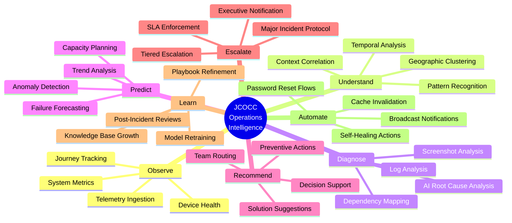

### 2.4 What JCOCC Is — And What It Is Not

| JCOCC **IS** | JCOCC **IS NOT** |
|--------------|------------------|
| Operations Intelligence Platform | Help Desk / Service Desk |
| Real-time Census Control Tower | CRM System |
| AI-Powered Diagnosis & Prediction Engine | Generic Ticketing System |
| Cross-System Correlation & Orchestration Layer | Standalone Mobile App |
| Executive Decision Support System | Reporting-Only Dashboard |
| Automated Resolution & Self-Service Engine | Manual Call Routing Tool |
| Major Incident Command Center | Email-Based Escalation Chain |
| Institutional Knowledge Repository | One-Time Census Tool |

### 2.5 Design Principles

| # | Principle | Description | Operational Impact |
|---|-----------|-------------|------------------|
| P1 | **Observe First, Ask Never** | Collect telemetry before users report problems | Reduces inbound support volume by 40%+ |
| P2 | **Journey-Aware Intelligence** | Know exactly where each enumerator stopped | Cuts diagnosis time from minutes to seconds |
| P3 | **Automate the Known, Escalate the Unknown** | 80% of issues have known patterns | Frees L2/L3 for complex problems |
| P4 | **Correlation Over Isolation** | One citizen complaint + 50 sync failures = one incident | Prevents duplicate work and missed major incidents |
| P5 | **Governorate-Aware, Nationally Unified** | Local autonomy with national visibility | Balances decentralization with central control |
| P6 | **Human-in-the-Loop for Judgment, Not Routing** | Humans decide policy; machines route and classify | Support Manager stops being a switchboard |
| P7 | **Audit Everything, Trust but Verify** | Full audit trail for government accountability | Compliance with national data governance |
| P8 | **Design for Census Day Zero and Day 365** | Works during peak load and quiet periods | Platform survives beyond single census event |
| P9 | **Arabic-First, Bilingual Operations** | Primary UX in Arabic; English for technical teams | Matches operator and field reality |
| P10 | **Fail-Safe, Not Fail-Silent** | When AI is uncertain, escalate with context | Never auto-close unresolved critical issues |

### 2.6 Strategic Alignment

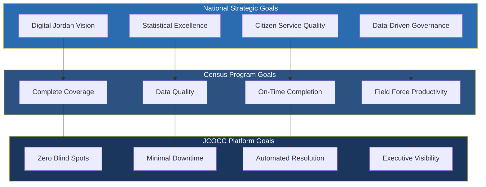

---

## 3. Strategic Context

### 3.1 Census as a National Critical Operation

The Jordan National Census is not a routine IT project. It is a **time-bound, irreversible national operation** with characteristics similar to:

| Characteristic | Implication for JCOCC |
|----------------|----------------------|
| **Fixed deadline** | No "fix it next sprint" — every hour of enumerator downtime costs coverage |
| **Massive concurrent users** | 10,000+ devices hitting systems simultaneously at peak |
| **Geographic dispersion** | 12 governorates, urban and rural, varying connectivity |
| **Multi-channel citizen interaction** | Field enumeration + self-enumeration + call center |
| **High public visibility** | Failures become news; executive pressure is immediate |
| **Single execution window** | Platform must work flawlessly during census period |
| **Legacy of next census** | Knowledge and platform must survive 10+ years |

### 3.2 Why Existing Systems Are Insufficient

The census ecosystem already has five mature systems. None was designed to be the **operational brain**:

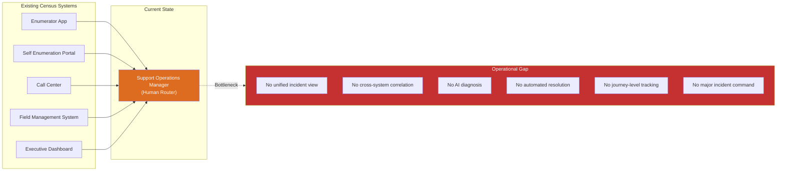

**JCOCC fills this gap** without replacing existing systems — it **orchestrates above them**.

### 3.3 Benchmarking — World-Class Operations Centers

| Reference System | Relevant Capability | JCOCC Adaptation |
|-----------------|---------------------|------------------|
| **NASA Mission Control** | Real-time telemetry, go/no-go decisions, anomaly response | Enumerator journey telemetry, census-day command protocols |
| **Palantir Foundry** | Entity resolution, cross-source correlation, operational ontology | Incident correlation, root cause graph, operational data model |
| **Google SRE** | Error budgets, toil reduction, automated remediation | SLA engine, runbook automation, self-healing actions |
| **Microsoft Sentinel** | SIEM correlation, AI investigation, playbooks | Security and operational event correlation, automated playbooks |
| **Telecom NOC** | Network-wide health, mass outage detection, broadcast | National connectivity monitoring, mass incident detection |
| **FEMA NIMS** | Incident command structure, unified command, staging | Major incident center, role-based command hierarchy |
| **ServiceNow ITSM** | Workflow automation, CMDB, knowledge base | *(Adapt concepts, NOT replicate as ticket system)* |

---

## 4. Problem Statement

### 4.1 Primary Problem

> **The Support Operations Manager is the single point of failure for all census operational issues.**

Today, when an enumerator cannot sync, a supervisor reports missing buildings, a citizen calls the call center, or a server slows down — every signal converges on one person or a small team who must:

1. **Receive** the report (phone, WhatsApp, email, walk-in)
2. **Classify** the issue (Is it login? Sync? GIS? Server?)
3. **Determine scope** (One user? One governorate? National?)
4. **Route** to the correct team (L1, L2, backend, DBA, DevOps, GIS)
5. **Track** resolution manually
6. **Communicate** back to the field
7. **Escalate** if unresolved
8. **Report** to management ad hoc

This is **unsustainable at national scale**.

### 4.2 Problem Decomposition

```mermaid
graph TD
    ROOT["Support Manager Bottleneck"]

    ROOT --> P1["Detection Gap"]
    ROOT --> P2["Classification Gap"]
    ROOT --> P3["Routing Gap"]
    ROOT --> P4["Visibility Gap"]
    ROOT --> P5["Correlation Gap"]
    ROOT --> P6["Knowledge Gap"]
    ROOT --> P7["Prediction Gap"]

    P1 --> P1A["Issues reported late or not at all"]
    P1 --> P1B["No proactive device/system monitoring"]

    P2 --> P2A["Same issue classified differently"]
    P2 --> P2B["No standardized taxonomy"]

    P3 --> P3A["Wrong team receives issue first"]
    P3 --> P3B["Multi-team issues ping-pong"]

    P4 --> P4A["Management lacks real-time picture"]
    P4 --> P4B["No single pane of glass"]

    P5 --> P5A["50 sync failures treated as 50 tickets"]
    P5 --> P5B["Major incidents missed until too late"]

    P6 --> P6A["Solutions rediscovered every time"]
    P6 --> P6B["No institutional memory"]

    P7 --> P7A["Reactive firefighting only"]
    P7 --> P7B["No capacity or failure forecasting"]

    style ROOT fill:#c53030,color:#fff
```

### 4.3 Quantified Pain Points (Target Baseline)

| Pain Point | Estimated Current Impact | JCOCC Target |
|------------|-------------------------|--------------|
| Average time to classify an issue | 5–15 minutes (manual) | < 10 seconds (AI) |
| Average time to route to correct team | 10–30 minutes | < 30 seconds (automated) |
| Duplicate incidents for same root cause | 60–80% of volume | < 5% (AI merge) |
| Issues detected before user report | < 10% | > 60% (proactive) |
| Issues resolved without human intervention | < 5% | > 40% (automation) |
| Support Manager direct interventions per day | 200+ at peak | < 20 (exceptions only) |
| Time to declare major incident | 30–60 minutes | < 5 minutes (auto-detect) |
| Mean time to diagnose root cause | 1–4 hours | < 30 minutes (AI-assisted) |

*Note: Baseline figures are estimates for planning. Phase 2 will define measurement methodology.*

### 4.4 Secondary Problems

| # | Problem | Business Impact |
|---|---------|-----------------|
| S1 | **No enumerator journey visibility** | Cannot answer "where did they stop?" without manual investigation |
| S2 | **Siloed system alerts** | Backend team sees server alerts; field team sees complaints; no connection |
| S3 | **Call center disconnected from field ops** | Citizen complaints not correlated with field issues in same area |
| S4 | **Shift handover information loss** | Night shift issues lost or repeated to day shift |
| S5 | **No workload balancing** | Some L1 agents overloaded while others idle |
| S6 | **Executive dashboard lacks operational depth** | KPIs shown but not actionable; no drill-down to live issues |
| S7 | **GIS issues treated as app issues** | Wrong team engaged; resolution delayed |
| S8 | **No broadcast capability** | Cannot quickly notify 10,000 enumerators of known workaround |

---

## 5. Business Objectives & Success Metrics

### 5.1 Primary Business Objectives

| ID | Objective | Description | Priority |
|----|-----------|-------------|----------|
| BO-01 | **Eliminate Support Manager Bottleneck** | Manager handles only exceptions, policy decisions, and major incidents | Critical |
| BO-02 | **Maximize Enumerator Productivity** | Minimize time enumerators spend blocked vs. enumerating | Critical |
| BO-03 | **Achieve National Operational Visibility** | Real-time view of all operations across all governorates | Critical |
| BO-04 | **Automate Routine Resolution** | Known issues resolved without human touch | High |
| BO-05 | **Enable Predictive Operations** | Detect and prevent failures before they impact field | High |
| BO-06 | **Institutionalize Knowledge** | Every resolution becomes reusable knowledge | High |
| BO-07 | **Support Executive Decision-Making** | Provide actionable intelligence, not just charts | High |
| BO-08 | **Ensure Audit & Accountability** | Full traceability for government compliance | Medium |
| BO-09 | **Enable 24/7 Shift Operations** | Seamless handover, no information loss | Medium |
| BO-10 | **Build Platform for Future Censuses** | Reusable national operations capability | Medium |

### 5.2 Key Performance Indicators (KPIs)

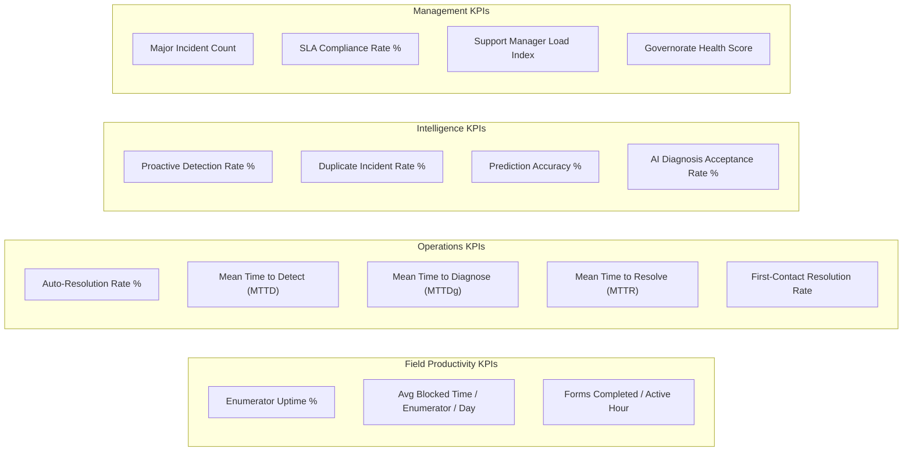

### 5.3 KPI Definitions & Targets

| KPI | Definition | Baseline (Est.) | Target | Measurement Frequency |
|-----|------------|-----------------|--------|---------------------|
| **Enumerator Uptime %** | % of active enumerator-hours without blocking issue | Unknown | > 95% | Real-time |
| **Auto-Resolution Rate** | % of operational events resolved without human | < 5% | > 40% | Hourly |
| **MTTD** | Time from issue occurrence to system detection | N/A (reactive) | < 2 min | Per incident |
| **MTTDg** | Time from detection to root cause identified | 1–4 hrs | < 30 min | Per incident |
| **MTTR** | Time from detection to resolution | 2–8 hrs | < 1 hr (P3), < 4 hrs (P1) | Per incident |
| **Proactive Detection Rate** | % of issues detected before user report | < 10% | > 60% | Daily |
| **Duplicate Incident Rate** | % of incidents that are duplicates of existing | 60–80% | < 5% | Daily |
| **SLA Compliance** | % of incidents resolved within SLA | Unknown | > 95% | Daily |
| **Support Manager Load Index** | Direct interventions / total incidents | ~100% | < 10% | Daily |
| **Governorate Health Score** | Composite score: uptime, sync rate, coverage | N/A | > 90 (0–100) | Real-time |

### 5.4 Success Criteria — Census Operations

The platform will be considered successful if, during live census operations:

1. ✅ No single person is required to manually route > 10% of operational events
2. ✅ Executive leadership can answer "What is the state of census operations right now?" in < 30 seconds
3. ✅ A governorate-wide sync failure is detected, classified, and escalated within 5 minutes — without anyone calling the support manager
4. ✅ An enumerator blocked for > 15 minutes receives proactive outreach or automated fix
5. ✅ 90%+ of shift handovers complete with zero information loss
6. ✅ Post-census: knowledge base contains 500+ validated resolution articles

---

## 6. Stakeholder Analysis

### 6.1 Stakeholder Map

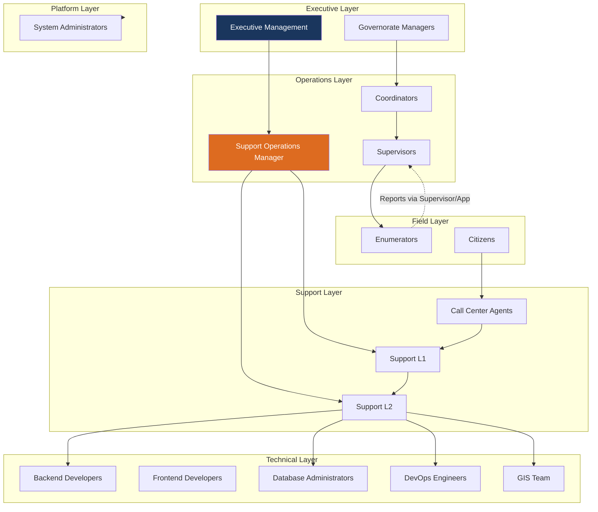

### 6.2 Stakeholder Profiles

| Stakeholder | Count (Est.) | Primary Need from JCOCC | Engagement Level | Influence |
|-------------|-------------|-------------------------|------------------|-----------|
| **Enumerators** | 10,000+ | Stay productive; quick fix when blocked | Users (indirect) | Low |
| **Supervisors** | 2,000+ | Visibility into team issues; escalate fast | Active reporters | Medium |
| **Coordinators** | 200+ | Governorate-level operational picture | Active operators | Medium |
| **Governorate Managers** | 12+ | Governorate health; decision support | Consumers + approvers | High |
| **Support L1** | 50–100 | Clear queue; AI-suggested solutions; less noise | Primary operators | Medium |
| **Support L2** | 20–40 | Deep diagnosis tools; log access; RCA support | Primary operators | Medium |
| **Support Operations Manager** | 1–3 | Exception-only queue; major incident command | Power user | Critical |
| **Call Center Agents** | 100–200 | Integrated view; citizen issue context | Active reporters | Medium |
| **Backend / Frontend Devs** | 10–20 | Targeted alerts; reproduction context | On-call responders | Medium |
| **DBA** | 3–5 | DB performance alerts; query diagnostics | On-call responders | Medium |
| **DevOps** | 5–10 | Infrastructure health; deployment control | On-call responders | High |
| **GIS Team** | 5–10 | Map/data issue queue; spatial context | Specialized responders | Medium |
| **Executive Management** | 5–10 | National KPIs; major incident status | Strategic consumers | Critical |
| **System Administrators** | 3–5 | Platform configuration; user management | Platform owners | High |
| **Citizens** | Millions | Seamless self-enumeration (indirect) | Indirect beneficiaries | Low |

### 6.3 Stakeholder Needs Matrix

| Need | ENUM | SUP | L1 | L2 | SOM | GM | EM | DEV |
|------|------|-----|----|----|-----|----|----|-----|
| Real-time status visibility | ○ | ● | ● | ● | ● | ● | ● | ● |
| Automated issue resolution | ● | ○ | ● | ○ | ● | ○ | ○ | ○ |
| AI diagnosis assistance | ○ | ○ | ● | ● | ● | ○ | ○ | ● |
| Journey-level tracking | ○ | ● | ● | ● | ● | ● | ○ | ○ |
| Major incident command | ○ | ○ | ○ | ● | ● | ● | ● | ● |
| Broadcast notifications | ● | ● | ○ | ○ | ● | ● | ● | ○ |
| Performance analytics | ○ | ● | ○ | ○ | ● | ● | ● | ○ |
| Audit trail | ○ | ○ | ○ | ○ | ● | ○ | ● | ○ |
| Workload balancing | ○ | ○ | ● | ○ | ● | ○ | ○ | ○ |
| Knowledge base access | ○ | ● | ● | ● | ● | ○ | ○ | ● |

● = Primary need | ○ = Secondary/indirect need

---

## 7. Current State Assessment (As-Is)

### 7.1 Existing System Landscape

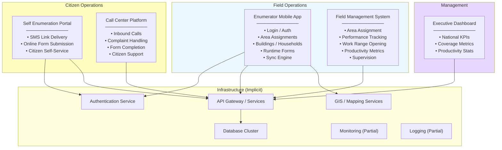

### 7.2 As-Is Operational Flow (Problem State)

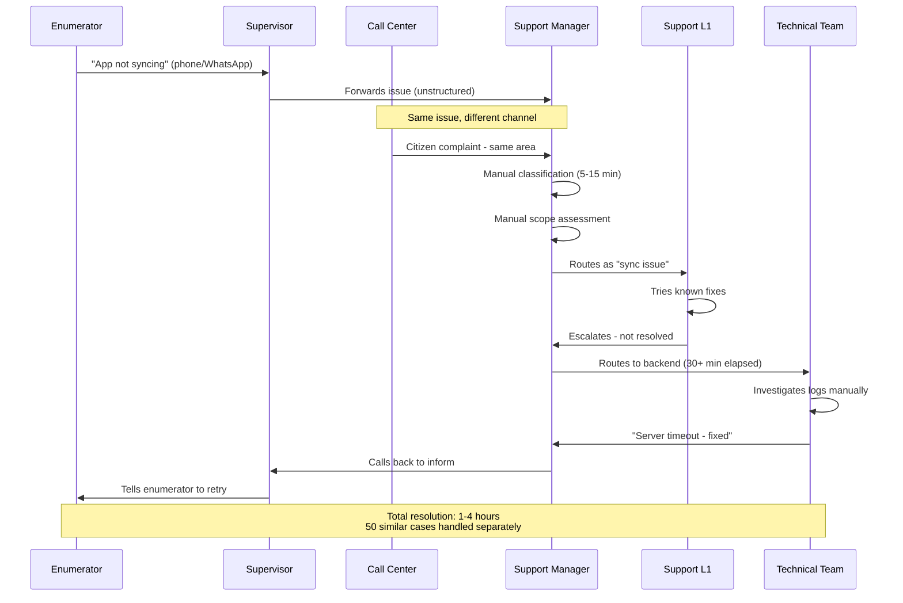

### 7.3 As-Is Gap Analysis

| Capability | Current State | Gap Severity | JCOCC Requirement |
|------------|--------------|--------------|-------------------|
| Unified incident view | None — issues scattered across channels | 🔴 Critical | Single operational event stream |
| Real-time enumerator tracking | FMS has productivity; no journey stage | 🔴 Critical | Journey-aware telemetry |
| Automated classification | Manual by Support Manager | 🔴 Critical | AI classification engine |
| Cross-system correlation | None | 🔴 Critical | Event correlation engine |
| Automated resolution | None | 🟠 High | Runbook automation engine |
| Major incident management | Ad hoc phone calls | 🔴 Critical | Major Incident Center |
| Knowledge management | Tribal knowledge, WhatsApp | 🟠 High | AI-powered knowledge base |
| Proactive monitoring | Partial infrastructure monitoring | 🟠 High | Full-stack observability |
| Broadcast communication | Manual phone tree | 🟠 High | Broadcast Center |
| Shift management | Informal handover | 🟡 Medium | Structured shift handover |
| SLA tracking | None | 🟠 High | SLA Engine |
| AI assistance | None | 🔴 Critical | AI Diagnosis Engine |

### 7.4 Current Integration Points (Known)

| Source System | Data/Event Available | Integration Potential | Priority |
|---------------|---------------------|----------------------|----------|
| Enumerator App | Login events, sync status, errors, GPS, device info | SDK telemetry + error hooks | P0 |
| Field Management System | Assignments, productivity, work ranges | REST/API events | P0 |
| Self Enumeration Portal | Submission status, errors, citizen sessions | Webhook/API events | P1 |
| Call Center | Call logs, complaint categories, resolutions | CTI/API integration | P1 |
| Executive Dashboard | KPI feeds (read) | API read + JCOCC enrich | P2 |
| Authentication | Login success/failure, lockouts | Auth event stream | P0 |
| API Gateway | Request metrics, errors, latency | APM/metrics feed | P0 |
| Database | Query performance, locks, connections | DB monitoring agent | P0 |
| GIS Services | Map tile errors, geocoding failures | Service health feed | P1 |
| Infrastructure | CPU, memory, disk, network | Prometheus/Azure Monitor | P0 |

---

## 8. Future State Vision (To-Be)

### 8.1 To-Be Operational Model

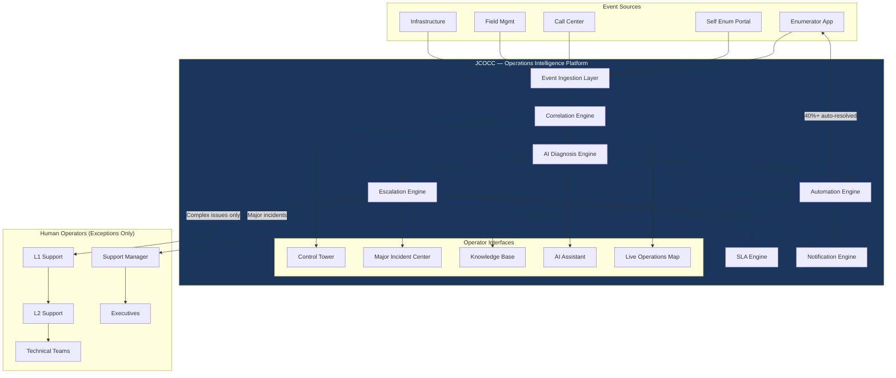

### 8.2 To-Be Sequence — Same Sync Failure Scenario

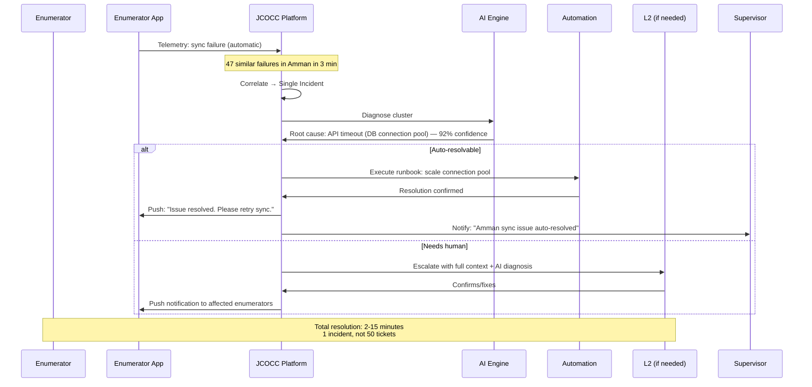

### 8.3 To-Be Capability Maturity

| Capability | As-Is Maturity | To-Be Maturity | Timeline |
|------------|---------------|----------------|----------|
| Event ingestion | Level 0 (None) | Level 4 (Real-time, all sources) | Phase 1 |
| Classification | Level 0 (Manual) | Level 4 (AI auto-classify) | Phase 1 |
| Correlation | Level 0 (None) | Level 4 (Cross-system, temporal, spatial) | Phase 1 |
| Diagnosis | Level 0 (Manual) | Level 3 (AI-assisted, human confirm) | Phase 2 |
| Resolution | Level 0 (Manual) | Level 3 (40% automated) | Phase 2 |
| Prediction | Level 0 (None) | Level 2 (Anomaly + trend) | Phase 3 |
| Knowledge | Level 0 (Tribal) | Level 3 (AI-generated, curated) | Phase 2 |
| Major Incidents | Level 0 (Ad hoc) | Level 4 (Full command center) | Phase 1 |

*Capability maturity model: 0=None, 1=Initial, 2=Developing, 3=Defined, 4=Optimized, 5=Autonomous*

---

## 9. Business Analysis

### 9.1 Business Context Diagram

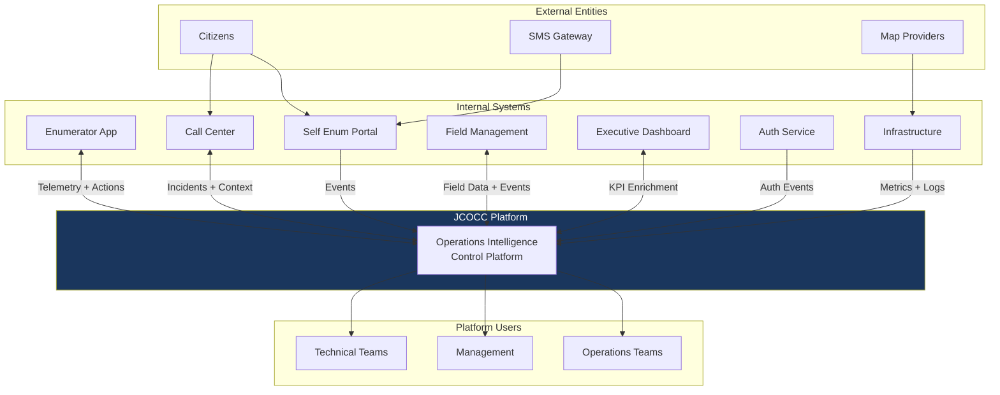

### 9.2 Business Process Areas

| Process Area | Description | Current Owner | JCOCC Role |
|-------------|-------------|---------------|------------|
| **Field Issue Management** | Handling enumerator operational problems | Support Manager | Primary owner — automate end-to-end |
| **Citizen Issue Management** | Call center and self-enum problems | Call Center Manager | Integrate and correlate with field |
| **Major Incident Management** | National/governorate-wide failures | Support Manager + IT Director | Major Incident Center |
| **Shift Operations** | 24/7 support coverage | Support Manager | Shift Management module |
| **Performance Monitoring** | Field productivity tracking | FMS + Management | Enrich with operational health |
| **Executive Reporting** | National census progress | Executive Dashboard | Add operational intelligence layer |
| **Knowledge Management** | Documenting solutions | Informal | AI Knowledge Base |
| **Capacity Management** | Server/DB scaling decisions | DevOps | Predictive capacity alerts |
| **Communication Management** | Notifying field force | Manual (phone tree) | Broadcast Center |
| **Audit & Compliance** | Government accountability | Manual logs | Audit Center |

### 9.3 Business Rules — Global

| Rule ID | Rule | Rationale |
|---------|------|-----------|
| BR-001 | Every operational event must be classified within 10 seconds of ingestion | Speed is critical during census |
| BR-002 | Duplicate events for the same root cause must be merged into a single incident | Prevent noise and duplicate work |
| BR-003 | Incidents affecting > 100 users in 5 minutes auto-escalate to Major Incident | National-scale failures need immediate command |
| BR-004 | P1 incidents must reach Support Manager within 2 minutes | Executive accountability |
| BR-005 | Automated resolution requires audit log entry | Government compliance |
| BR-006 | AI diagnosis below 70% confidence must not auto-resolve | Fail-safe principle |
| BR-007 | All escalations must include full context (journey stage, device, location, logs) | Eliminate re-investigation |
| BR-008 | Governorate Managers see only their governorate unless escalated nationally | Data governance |
| BR-009 | Enumerator PII must not appear in incident details visible to L1 | Privacy protection |
| BR-010 | Shift handover must include all open P1/P2 incidents | Zero information loss |
| BR-011 | Broadcast messages require Support Manager or above approval | Prevent misinformation |
| BR-012 | Knowledge articles require L2 validation before auto-suggestion | Quality control |
| BR-013 | Self-enumeration issues and field issues in same EA code must be correlated | Citizen + field connection |
| BR-014 | SLA clock starts at detection, not at report | Proactive detection advantage |
| BR-015 | Major Incident requires dedicated incident commander role assignment | NIMS-inspired protocol |

### 9.4 Business Event Taxonomy (Top Level)

```mermaid
graph TD
    ROOT["Operational Events"]

    ROOT --> AUTH_EV["Authentication Events"]
    ROOT --> SYNC_EV["Synchronization Events"]
    ROOT --> APP_EV["Application Events"]
    ROOT --> DATA_EV["Data Events"]
    ROOT --> NET_EV["Network Events"]
    ROOT --> INFRA_EV["Infrastructure Events"]
    ROOT --> GIS_EV["GIS / Map Events"]
    ROOT --> FIELD_EV["Field Operations Events"]
    ROOT --> CITIZEN_EV["Citizen Events"]
    ROOT --> SEC_EV["Security Events"]

    AUTH_EV --> AUTH_EV1["Login Failure"]
    AUTH_EV --> AUTH_EV2["Password Reset Request"]
    AUTH_EV --> AUTH_EV3["Account Lockout"]
    AUTH_EV --> AUTH_EV4["Token Expiry"]

    SYNC_EV --> SYNC_EV1["Sync Failure"]
    SYNC_EV --> SYNC_EV2["Sync Timeout"]
    SYNC_EV --> SYNC_EV3["Partial Sync"]
    SYNC_EV --> SYNC_EV4["Sync Conflict"]

    APP_EV --> APP_EV1["Runtime Form Crash"]
    APP_EV --> APP_EV2["Form Load Failure"]
    APP_EV --> APP_EV3["App Crash"]
    APP_EV --> APP_EV4["Storage Full"]

    DATA_EV --> DATA_EV1["Missing Buildings"]
    DATA_EV --> DATA_EV2["Missing Households"]
    DATA_EV --> DATA_EV3["Assignment Download Failure"]
    DATA_EV --> DATA_EV4["Data Validation Error"]

    NET_EV --> NET_EV1["No Connectivity"]
    NET_EV --> NET_EV2["Weak Signal"]
    NET_EV --> NET_EV3["API Timeout"]
    NET_EV --> NET_EV4["DNS Failure"]

    INFRA_EV --> INFRA_EV1["Server Outage"]
    INFRA_EV --> INFRA_EV2["Database Timeout"]
    INFRA_EV --> INFRA_EV3["High CPU/Memory"]
    INFRA_EV --> INFRA_EV4["Service Degradation"]

    GIS_EV --> GIS_EV1["Map Load Failure"]
    GIS_EV --> GIS_EV2["GPS Inaccuracy"]
    GIS_EV --> GIS_EV3["Geocoding Error"]
    GIS_EV --> GIS_EV4["Missing Map Tiles"]

    FIELD_EV --> FIELD_EV1["Work Range Issue"]
    FIELD_EV --> FIELD_EV2["Supervisor Escalation"]
    FIELD_EV --> FIELD_EV3["Productivity Anomaly"]

    CITIZEN_EV --> CITIZEN_EV1["Self-Enum Failure"]
    CITIZEN_EV --> CITIZEN_EV2["Call Center Complaint"]
    CITIZEN_EV --> CITIZEN_EV3["SMS Delivery Failure"]

    SEC_EV --> SEC_EV1["Suspicious Login"]
    SEC_EV --> SEC_EV2["Data Access Anomaly"]
```

### 9.5 Priority Classification Matrix

| Priority | Label | Criteria | SLA (Detection → Resolution) | Escalation |
|----------|-------|----------|------------------------------|------------|
| **P1** | Critical | National outage OR > 500 users affected OR census data at risk | 15 min detect → 1 hr resolve | Immediate → Support Manager + Executive |
| **P2** | High | Governorate-wide OR > 100 users OR supervisor escalation | 5 min detect → 4 hr resolve | 15 min → L2 + Support Manager |
| **P3** | Medium | Multiple users (5–100) OR recurring pattern OR single EA blocking | 10 min detect → 8 hr resolve | 30 min → L2 if unresolved |
| **P4** | Low | Single user, non-blocking, workaround available | 30 min detect → 24 hr resolve | Standard L1 queue |
| **P5** | Informational | Anomaly detected, no user impact, preventive | Best effort | Log only; feed prediction engine |

### 9.6 Cost of Inaction Analysis

| Scenario | Without JCOCC | With JCOCC | Impact |
|----------|--------------|------------|--------|
| National sync outage (2 hours) | 10,000 enumerators idle × 2 hrs = 20,000 enumerator-hours lost | Detected in 2 min, resolved in 15 min = 2,500 hours lost | **87% reduction** |
| Support Manager unavailable (sick) | Operations paralyzed; no routing | Platform continues auto-routing and auto-resolving | **Continuity guaranteed** |
| Duplicate incident handling | 50 agents × 30 min each = 25 hours wasted | 1 incident, AI-diagnosed, auto-resolved = 15 min | **99% reduction** |
| Major incident undeclared for 1 hour | Cascade failures, executive blindsided | Auto-declared in 5 min, command center activated | **Critical risk eliminated** |
| Knowledge loss post-census | Team disperses; next census starts from zero | 500+ KB articles, trained AI models | **Institutional memory preserved** |

---

## 10. Operational Domains

JCOCC organizes census operations into **seven operational domains**, each with distinct workflows, actors, and automation potential:

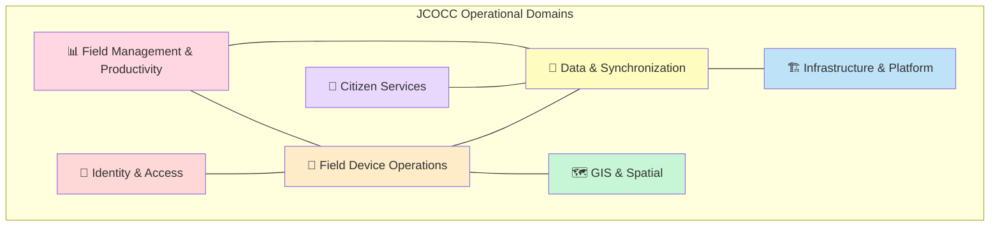

### 10.1 Domain Summary

| Domain | Scope | Primary Actors | Auto-Resolution Potential | AI Value |
|--------|-------|----------------|--------------------------|----------|
| **Identity & Access** | Login, password, tokens, lockouts | Enumerators, L1 | **Very High** (80%+) | Pattern detection for brute force |
| **Field Device Operations** | App crashes, storage, GPS, forms | Enumerators, L1, L2 | **Medium** (30%) | Screenshot analysis, crash log analysis |
| **Data & Synchronization** | Sync failures, conflicts, downloads | Enumerators, Backend, DBA | **Medium-High** (50%) | Correlation, root cause from logs |
| **GIS & Spatial** | Maps, geocoding, missing buildings | GIS Team, L2 | **Low** (15%) | Spatial clustering of issues |
| **Infrastructure & Platform** | Servers, DB, API, network | DevOps, DBA, Backend | **High** (60%) | Anomaly detection, predictive scaling |
| **Citizen Services** | Self-enum, call center, SMS | Call Center, L1 | **Medium** (35%) | Complaint classification, correlation |
| **Field Management** | Assignments, work ranges, productivity | Supervisors, Coordinators | **Medium** (40%) | Productivity anomaly detection |

---

## 11. Business Capability Map

```mermaid
graph TB
    subgraph L1Cap["Level 1: Core Capabilities"]
        C1["Operations Monitoring"]
        C2["Incident Intelligence"]
        C3["Automated Response"]
        C4["Communication & Notification"]
        C5["Knowledge & Learning"]
        C6["Command & Control"]
    end

    subgraph L2Mon["Operations Monitoring"]
        C1A["Real-Time Telemetry"]
        C1B["Journey Tracking"]
        C1C["Health Dashboards"]
        C1D["Live Operations Map"]
    end

    subgraph L2Inc["Incident Intelligence"]
        C2A["Event Classification"]
        C2B["Correlation & Dedup"]
        C2C["AI Diagnosis"]
        C2D["Root Cause Analysis"]
        C2E["Prediction & Anomaly Detection"]
    end

    subgraph L2Auto["Automated Response"]
        C3A["Runbook Execution"]
        C3B["Self-Healing Actions"]
        C3C["Auto-Escalation"]
        C3D["SLA Management"]
    end

    subgraph L2Comm["Communication"]
        C4A["Push Notifications"]
        C4B["Broadcast Center"]
        C4C["Shift Handover"]
        C4D["Executive Alerts"]
    end

    subgraph L2Know["Knowledge & Learning"]
        C5A["Knowledge Base"]
        C5B["AI Article Generation"]
        C5C["Playbook Library"]
        C5D["Post-Incident Review"]
    end

    subgraph L2Cmd["Command & Control"]
        C6A["Control Tower"]
        C6B["Major Incident Center"]
        C6C["Decision Support"]
        C6D["Audit & Compliance"]
    end

    C1 --> C1A & C1B & C1C & C1D
    C2 --> C2A & C2B & C2C & C2D & C2E
    C3 --> C3A & C3B & C3C & C3D
    C4 --> C4A & C4B & C4C & C4D
    C5 --> C5A & C5B & C5C & C5D
    C6 --> C6A & C6B & C6C & C6D
```

---

## 12. Constraints & Assumptions

### 12.1 Constraints

| ID | Constraint | Impact on Design |
|----|-----------|------------------|
| C-01 | Census date is fixed — platform must be production-ready before census start | Phased delivery; MVP by T-60 days |
| C-02 | Existing systems cannot be replaced — JCOCC integrates, not replaces | Integration-first architecture |
| C-03 | Government data sovereignty — data must remain in Jordan | On-premise or Jordan-based cloud |
| C-04 | Arabic is the primary operational language | Arabic-first UX; bilingual support |
| C-05 | Enumerator devices are heterogeneous (Android versions, specs) | Device Health Center must handle diversity |
| C-06 | Rural areas have limited connectivity | Offline-aware telemetry; store-and-forward |
| C-07 | Budget and team size are finite | Prioritize high-impact automation first |
| C-08 | Security and audit requirements for government systems | Full audit trail; RBAC; encryption |
| C-09 | Platform must not add latency to enumerator app | Lightweight SDK; async telemetry |
| C-10 | Existing call center platform has its own workflow | Integrate, not replace call center |

### 12.2 Assumptions

| ID | Assumption | Risk if Wrong |
|----|-----------|---------------|
| A-01 | Existing systems expose APIs or can be instrumented for event streaming | Manual integration fallback needed |
| A-02 | Enumerator app can embed a lightweight telemetry SDK | Reduced journey visibility |
| A-03 | Support teams adopt the platform within 2 weeks of training | Change management plan needed |
| A-04 | AI models can be trained on historical support data (if available) | Cold-start with rule-based classification |
| A-05 | Infrastructure monitoring (Prometheus/Azure Monitor) exists or will be deployed | JCOCC deploys its own agents |
| A-06 | Census operations run 24/7 during active enumeration period | Shift management is mandatory |
| A-07 | Executive leadership supports automated resolution (trust in AI) | Human-in-the-loop for all resolutions initially |
| A-08 | Network connectivity is available at support center operations | Offline mode for control tower |
| A-09 | GIS team can provide map service health endpoints | GIS issues diagnosed reactively only |
| A-10 | Single census period is ~30–45 days of peak operations | Platform must handle peak + quiet periods |

### 12.3 Dependencies

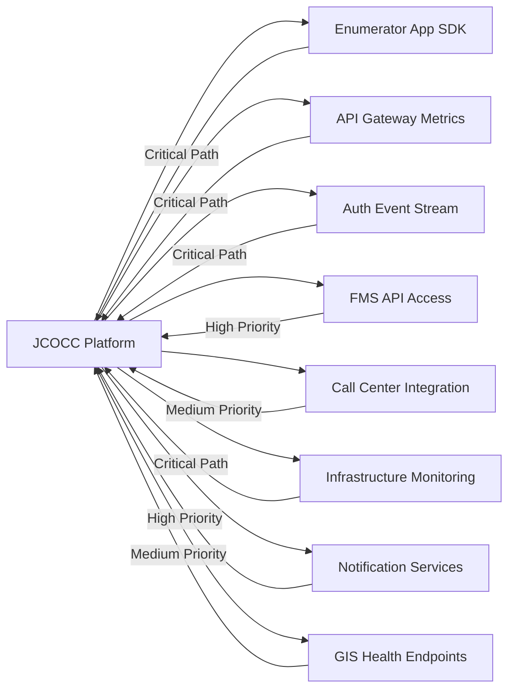

---

## 13. Phase 1 Decisions & Recommendations

### 13.1 Architectural Direction (Preview for Phase 3)

| Decision | Recommendation | Rationale |
|----------|---------------|-----------|
| Platform type | Event-driven Operations Intelligence Platform | Real-time correlation requires event architecture |
| Deployment | Hybrid: control plane centralized, telemetry edge-collected | National scale with connectivity constraints |
| AI approach | Hybrid: rule-based (Phase 1) → ML (Phase 2) → LLM-assisted (Phase 3) | Cold-start problem; build trust incrementally |
| Integration pattern | Event streaming (primary) + REST API (secondary) | Real-time needs streams; CRUD needs APIs |
| UI paradigm | Control Tower (not ticket queue) | Reinforce "not a help desk" philosophy |
| Data model | Operational Event → Correlated Incident → Resolution | Event-sourced, not ticket-sourced |

### 13.2 Delivery Recommendations

| Phase | Focus | Duration (Est.) |
|-------|-------|-----------------|
| **Phase A — Foundation** | Event ingestion, classification, control tower, basic escalation | 8–10 weeks |
| **Phase B — Intelligence** | AI diagnosis, correlation, automation runbooks, knowledge base | 6–8 weeks |
| **Phase C — Command** | Major incident center, broadcast, shift management, live map | 4–6 weeks |
| **Phase D — Optimization** | Prediction, advanced AI, workload balancing, analytics | 4–6 weeks |
| **Phase E — Hardening** | Load testing, DR, security audit, operator training | 4 weeks |

### 13.3 Critical Success Factors

1. **Executive sponsorship** — Platform must have direct executive mandate
2. **Enumerator app SDK integration** — Without journey telemetry, platform is blind
3. **Support team buy-in** — Position as "your AI assistant," not "replacement"
4. **Major incident drill** — Conduct at least 2 simulated major incidents before census
5. **Gradual automation trust** — Start with AI suggestions; graduate to auto-resolution
6. **Governorate pilot** — Test in one governorate before national rollout

### 13.4 Challenge to Requirements

| Original Requirement | Challenge | Recommendation |
|---------------------|-----------|----------------|
| "Not a ticketing system" | Operators still need to track open issues | Use **Incident** terminology; UI shows operational events, not ticket queues |
| "AI must analyze screenshots" | Privacy + device diversity concerns | Implement with enumerator consent; support top 5 device profiles first |
| "100% automation goal" (implied) | Dangerous for census data integrity | Cap auto-resolution at P3/P4; P1/P2 always require human confirmation |
| "Integrate with all systems" | Some systems may lack APIs | Define minimum viable integration per system; manual fallback for gaps |
| "Support 10,000+ enumerators" | Peak telemetry volume could be enormous | Edge aggregation; sample non-critical telemetry; prioritize error events |

---

## 14. Phase 1 Approval Gate

### 14.1 Phase 1 Deliverables Checklist

| # | Deliverable | Status |
|---|-------------|--------|
| 1 | Vision Document | ✅ Complete |
| 2 | Business Analysis | ✅ Complete |
| 3 | Stakeholder Analysis | ✅ Complete |
| 4 | As-Is / To-Be Assessment | ✅ Complete |
| 5 | Business Objectives & KPIs | ✅ Complete |
| 6 | Operational Domains | ✅ Complete |
| 7 | Business Capability Map | ✅ Complete |
| 8 | Business Rules (Global) | ✅ Complete |
| 9 | Event Taxonomy (Top Level) | ✅ Complete |
| 10 | Priority Matrix | ✅ Complete |
| 11 | Constraints & Assumptions | ✅ Complete |
| 12 | Recommendations & Challenges | ✅ Complete |

### 14.2 Questions for Stakeholder Review

Before proceeding to **Phase 2 (Business Workflow Bible & Journey Maps)**, please confirm or clarify:

1. **Census timeline** — What is the exact census start date? (Drives delivery schedule)
2. **Existing API availability** — Which existing systems have documented APIs today?
3. **Historical data** — Is there historical support/issue data from previous operations?
4. **Support team size** — Exact headcount for L1, L2, and on-call technical teams?
5. **Infrastructure** — On-premise, Azure Jordan, or hybrid?
6. **Call center platform** — Which product/platform does the call center use?
7. **Executive sponsor** — Who is the executive owner of JCOCC?
8. **Pilot governorate** — Which governorate for initial pilot?
9. **Auto-resolution authority** — Is leadership comfortable with automated fixes for P3/P4 from day one?
10. **Budget envelope** — Rough order of magnitude for platform build?

### 14.3 Next Phase Preview

**Phase 2** will deliver:

- Complete **Business Workflow Bible** (30+ operational scenarios with full workflow definitions)
- **Enumerator Journey Map** (detailed stage-by-stage with failure points)
- **Supervisor Journey Map**
- **Support Agent Journey Map**
- **Support Manager Journey Map**
- **Executive Journey Map**
- **Operational Journey Maps** per domain
- **Citizen Impact Journey Map**

---

> **⏸️ PHASE 1 COMPLETE — AWAITING APPROVAL TO PROCEED TO PHASE 2**
>
> Please review this document and confirm:
> - Vision and business objectives align with your expectations
> - Stakeholder map is complete
> - Operational domains and capability map are correct
> - Business rules and priority matrix are acceptable
> - Answer clarification questions in Section 14.2
>
> **Reply with approval to proceed to Phase 2, or provide corrections.**

---

*Document prepared for the Department of Statistics — Hashemite Kingdom of Jordan*  
*Jordan Census Operations Control Center (JCOCC) — Master Blueprint*  
*Phase 1 of 6 — Version 1.0.0-draft*
