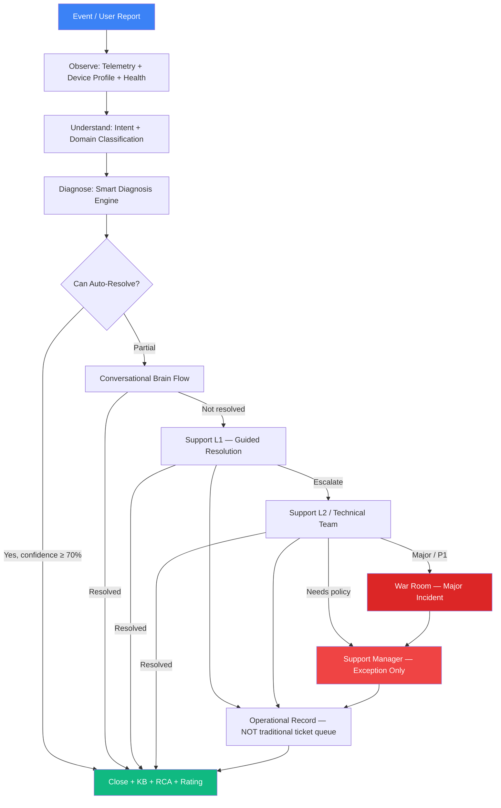
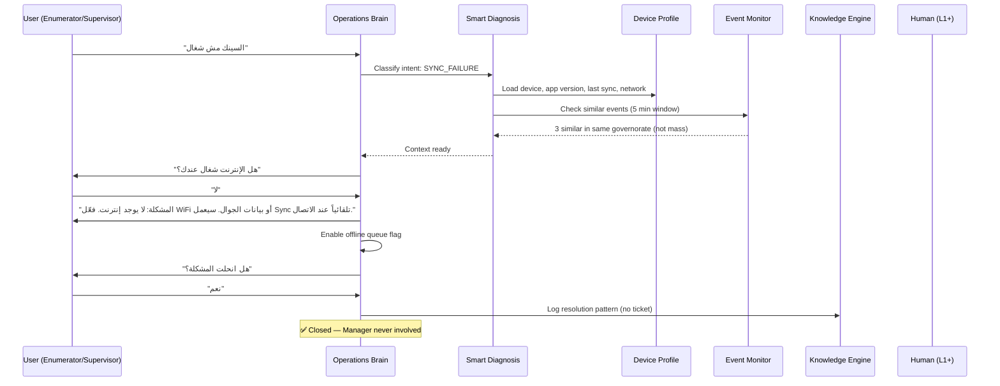
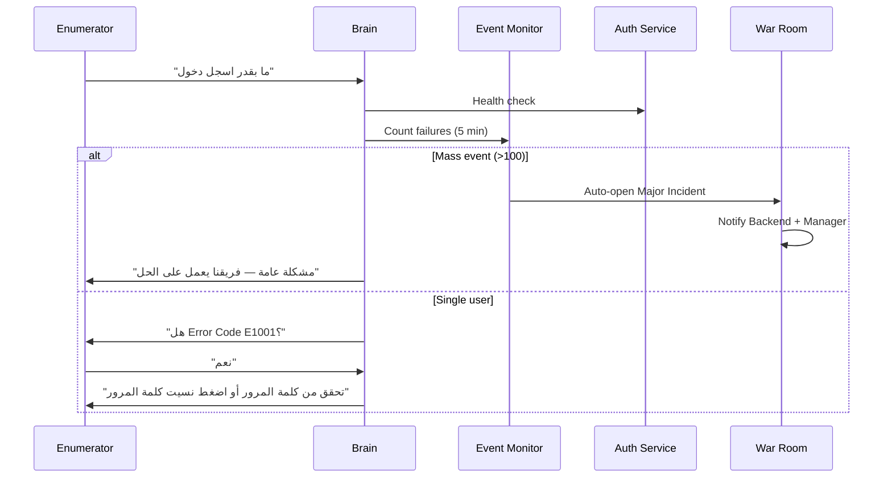
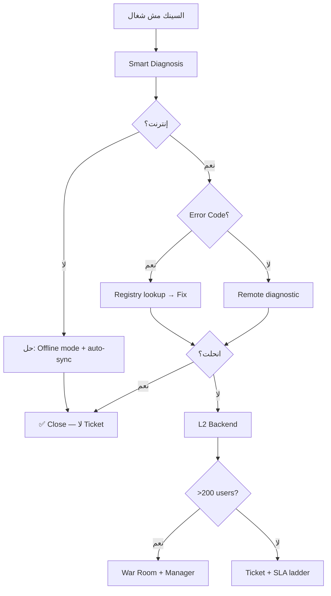
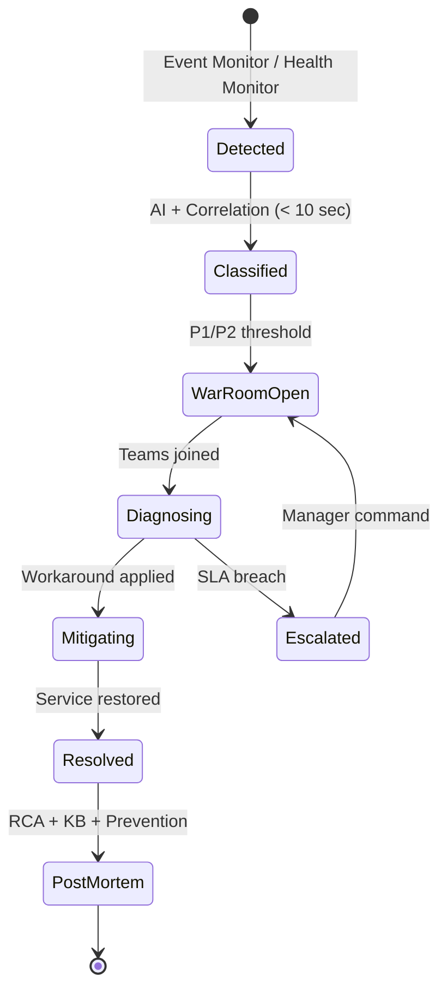
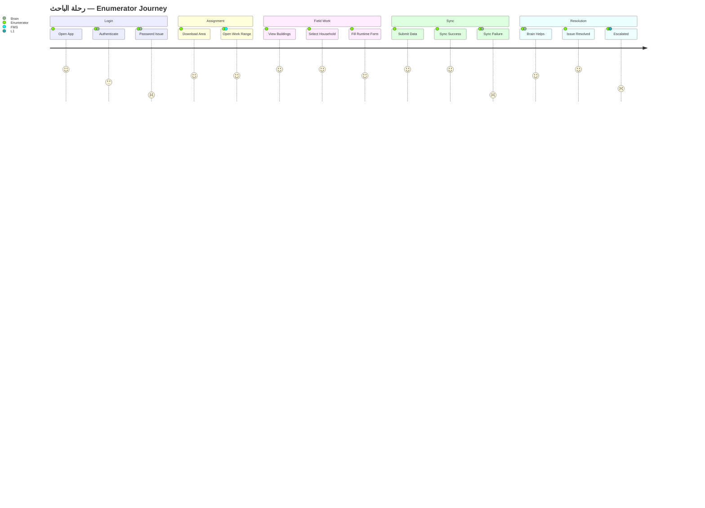
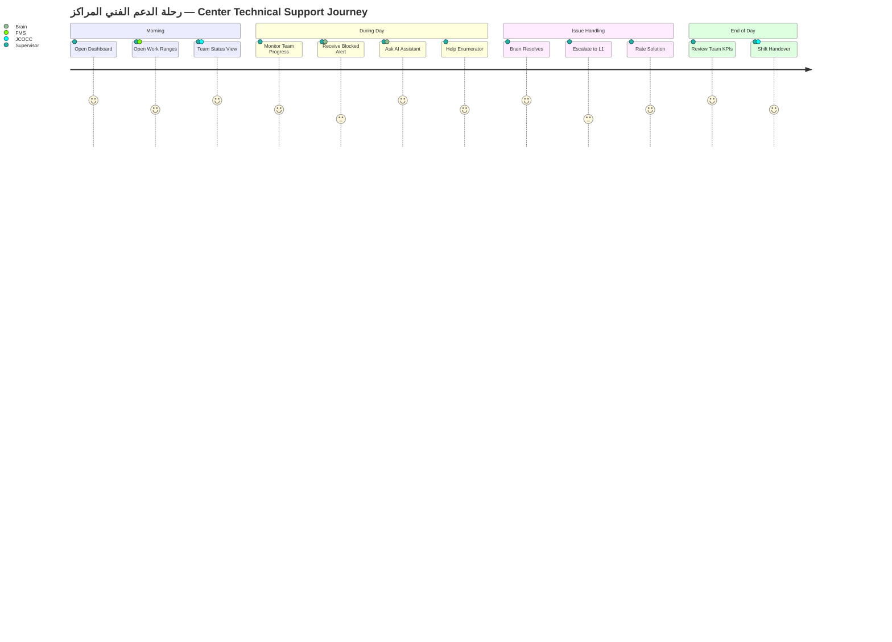
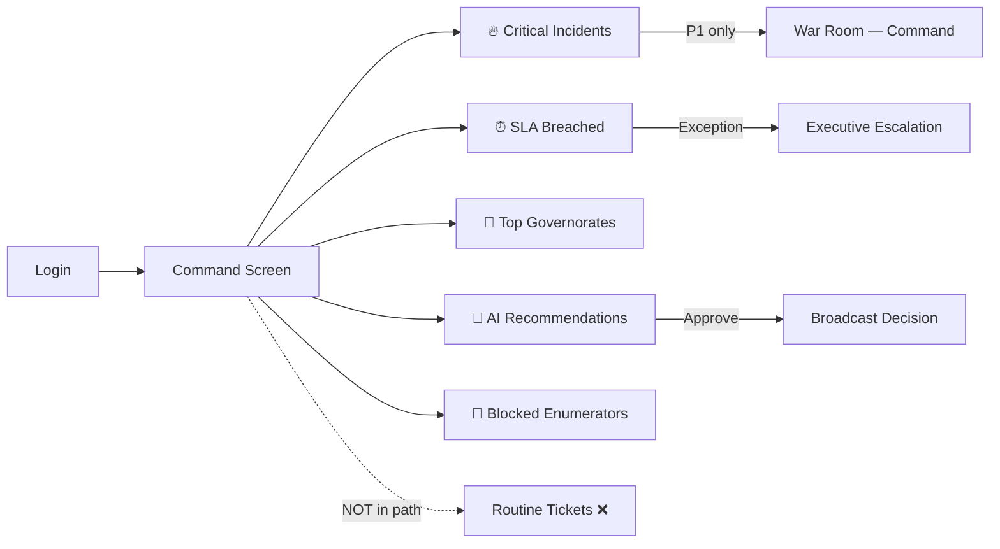
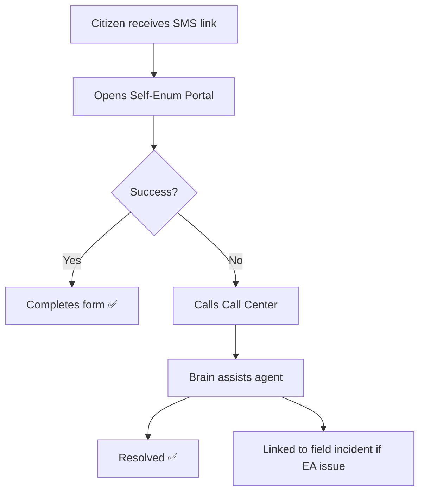
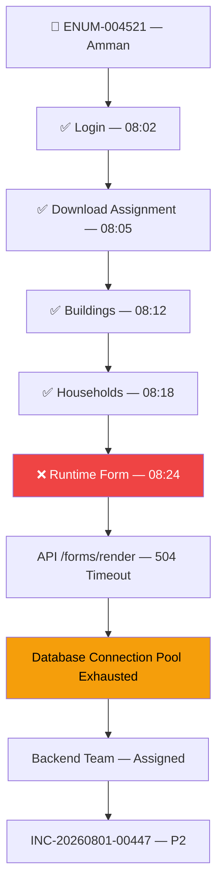

# Phase 2: Business Workflow Bible & Journey Maps

**Jordan Census Operations Control Center (JCOCC)**  
**Document ID:** JCOCC-BP-002  
**Phase:** 2 of 6  
**Status:** Draft for Review  
**Aligned With:** [Product Vision & Capability Manifest](./product-vision-capability-manifest.md)

---

## Table of Contents

1. [Workflow Design Principles](#1-workflow-design-principles)
2. [Universal Resolution Flow — Operations Brain](#2-universal-resolution-flow--operations-brain)
3. [Workflow Template Reference](#3-workflow-template-reference)
4. [Business Workflow Bible — Identity & Access](#4-business-workflow-bible--identity--access)
5. [Business Workflow Bible — Field Device & App](#5-business-workflow-bible--field-device--app)
6. [Business Workflow Bible — Synchronization & Data](#6-business-workflow-bible--synchronization--data)
7. [Business Workflow Bible — GIS & Spatial](#7-business-workflow-bible--gis--spatial)
8. [Business Workflow Bible — Infrastructure & Network](#8-business-workflow-bible--infrastructure--network)
9. [Business Workflow Bible — Citizen & Call Center](#9-business-workflow-bible--citizen--call-center)
10. [Business Workflow Bible — Field Management](#10-business-workflow-bible--field-management)
11. [Business Workflow Bible — Major Incidents & National Outages](#11-business-workflow-bible--major-incidents--national-outages)
12. [User Journey Maps](#12-user-journey-maps)
13. [Operational Journey Maps by Domain](#13-operational-journey-maps-by-domain)
14. [Digital Twin — Problem Journey Visualization](#14-digital-twin--problem-journey-visualization)
15. [Cross-Workflow Business Rules](#15-cross-workflow-business-rules)
16. [Phase 2 Approval Gate](#16-phase-2-approval-gate)

---

## 1. Workflow Design Principles

Every workflow in JCOCC follows these non-negotiable rules derived from the **Operations Brain** philosophy:

| # | Principle | Implementation |
|---|-----------|----------------|
| WP-01 | **Resolve Before Route** | Brain attempts resolution before any human or ticket |
| WP-02 | **Context Before Questions** | Smart Diagnosis pulls Device Profile + telemetry before asking user |
| WP-03 | **Correlate Before Count** | 200 login failures = 1 incident, not 200 tickets |
| WP-04 | **Ticket Is Last Resort** | Ticket created only when automated + L1 paths exhausted |
| WP-05 | **Manager Is Exception-Only** | Support Manager sees P1, War Room, SLA breach — not routing queue |
| WP-06 | **Every Resolution Teaches** | Closed workflow feeds Knowledge Engine + RCA |
| WP-07 | **Proactive Beats Reactive** | Health Monitor + Event Monitor trigger before user report when possible |
| WP-08 | **Digital Twin Always** | Every blocked enumerator has visual journey trace |



---

## 2. Universal Resolution Flow — Operations Brain

This flow applies to **every** user-facing scenario before workflow-specific logic.

### 2.1 Brain Conversation Model



### 2.2 When Brain Creates Operational Record (Not "Ticket First")

| Condition | Action |
|-----------|--------|
| Auto-resolved | No operational record, or audit log only |
| Brain + L1 resolved | Lightweight record for analytics |
| L2+ involved | Full operational record with timeline |
| P1 / Major | War Room incident + Manager notification |
| Recurring pattern (3+ times same user) | Flag Device Profile + supervisor alert |

---

## 3. Workflow Template Reference

Each workflow below uses this structure:

| Field | Description |
|-------|-------------|
| **ID** | Unique workflow identifier |
| **Trigger** | What initiates the workflow |
| **Actors** | Human and system participants |
| **Systems** | Integrated platforms involved |
| **Brain Flow** | Conversational / diagnostic steps |
| **Smart Diagnosis Checks** | Automatic context pulls |
| **Business Rules** | Decision logic |
| **Automatic Actions** | System executes without human |
| **AI Actions** | ML/LLM-assisted steps |
| **Escalation Rules** | When and to whom |
| **Notifications** | Channels and recipients |
| **SLA** | Time targets by priority |
| **Resolution Path** | Step-by-step to close |
| **Success Criteria** | Definition of done |
| **Failure Scenarios** | What can go wrong |
| **Recovery Scenarios** | Fallback paths |
| **Knowledge Output** | What KB article is generated |
| **RCA Category** | Root cause classification |

---

## 4. Business Workflow Bible — Identity & Access

### WF-IA-001: Enumerator Forgot Password

| Field | Value |
|-------|-------|
| **ID** | WF-IA-001 |
| **Trigger** | User selects "Forgot Password" OR reports via supervisor/call center |
| **Actors** | Enumerator, Operations Brain, Auth Service, Notification Service |
| **Systems** | Enumerator App, JCOCC Brain, Auth Service, SMS Gateway |

**Brain Flow:**
1. "هل تتذكر اسم المستخدم؟" → Yes/No
2. If No → guide to supervisor for identity verification
3. If Yes → "سنرسل رابط إعادة تعيين عبر SMS"
4. Confirm phone number (masked: ***1234)
5. Send reset link → "تحقق من SMS خلال 2 دقيقة"
6. "هل وصلك الرابط؟" → Yes → "هل تم تغيير كلمة المرور؟" → Close

**Smart Diagnosis Checks:**
- Account exists?
- Account locked? (failed attempts)
- SMS service health
- Phone number on file valid?

**Business Rules:**
- BR-IA-001: Max 3 reset attempts per 24 hours
- BR-IA-002: Locked account requires supervisor unlock after 5 failed logins
- BR-IA-003: No Manager involvement for standard reset

**Automatic Actions:**
- Send SMS reset link via Auth Service
- Unlock account if lock expired (>30 min)
- Log event to Device Profile

**AI Actions:**
- Intent: `PASSWORD_RESET`
- Match similar: "نسيت كلمة السر", "ما بقدر ادخل", "password"

**Escalation:** Only if SMS fails 3 times → L1 Call Center

**Notifications:** SMS to enumerator; none to Manager

**SLA:** Auto-resolve target: **2 minutes** | L1 if needed: **15 minutes**

**Success Criteria:** Enumerator logs in successfully within 30 min

**Failure Scenarios:** SMS gateway down; wrong phone number; account disabled

**Recovery:** Call center manual verification → temporary password → force change on login

**Knowledge Output:** "Password Reset via SMS — Standard Flow"

**RCA Category:** User Error (80%) | Auth Service (15%) | SMS Gateway (5%)

---

### WF-IA-002: Login Failure

| Field | Value |
|-------|-------|
| **ID** | WF-IA-002 |
| **Trigger** | Failed login event from app OR user report OR Event Monitor cluster |
| **Actors** | Enumerator, Brain, Auth Service, L1, Backend Dev, Support Manager |
| **Systems** | Enumerator App, Auth Service, API Gateway, JCOCC Event Monitor |

**Brain Flow:**
1. Pull Device Profile + last 5 login attempts
2. "هل تظهر رسالة خطأ؟" → capture error code
3. If E1001 (Invalid credentials) → "تحقق من اسم المستخدم وكلمة المرور" → offer reset
4. If E1002 (Account locked) → auto-unlock if time elapsed OR supervisor unlock flow
5. If E1003 (Server error) → check Auth Service health → if down, mass incident path
6. "هل انحلت؟" → Close or escalate

**Smart Diagnosis Checks:**
- Auth Service health status
- Event Monitor: login failures in 5 min window (same governorate / national)
- Error code from app telemetry
- Account status (active, locked, expired)
- App version compatibility with auth API

**Business Rules:**
- BR-IA-010: > 100 login failures / 5 min → auto Major Incident
- BR-IA-011: Single user + E1001 → Brain only, no ticket
- BR-IA-012: E1003 + Auth degraded → proactive push to all affected governorate

**Automatic Actions:**
- Correlation cluster creation
- Auth health check ping
- Push notification: "جاري التحقق من خدمة الدخول..."
- If mass: War Room pre-stage

**AI Actions:**
- Classify error screenshot if uploaded
- Predict root cause: Auth (85%) vs Network (10%) vs User (5%) for mass events
- Similar tickets: show count + resolution

**Escalation:**

| Condition | Escalate To | Time |
|-----------|-------------|------|
| Single user, Brain fails | L1 | 15 min |
| 5–100 users | L2 Backend | 5 min |
| > 100 users | War Room + Manager + Backend | Immediate |

**Notifications:**
- T+0: Backend team (if mass)
- T+40: Reminder if SLA 60 min
- T+60: Team Lead
- T+75: Management (P1 only)

**SLA:** P3 single user: 30 min | P2 governorate: 1 hr | P1 national: 15 min detect, 1 hr resolve

**Success Criteria:** Login success rate restored to baseline; affected users notified

**Failure Scenarios:** Auth DB corruption; certificate expiry; national DNS failure

**Recovery:** Failover to auth replica; emergency read-only mode; manual enumerator list verification

**Knowledge Output:** "Login Failure — [Error Code] — [Root Cause]"

**RCA Category:** Bug | Server | User Error | Network | Training



---

### WF-IA-003: Account Lockout

| Field | Value |
|-------|-------|
| **Trigger** | 5 consecutive failed login attempts |
| **Brain Flow** | Inform user locked → wait 30 min OR supervisor unlock request |
| **Auto Action** | Auto-unlock after 30 min; notify supervisor if 3rd lockout in 7 days |
| **Escalation** | Recurring lockout → Training flag on Device Profile |
| **SLA** | 5 min (auto) or 15 min (supervisor) |
| **RCA** | User Error | Training |

---

## 5. Business Workflow Bible — Field Device & App

### WF-FD-001: GPS Problem

| Field | Value |
|-------|-------|
| **ID** | WF-FD-001 |
| **Trigger** | GPS accuracy > 50m OR location null OR user report "GPS لا يعمل" |
| **Actors** | Enumerator, Brain, Supervisor AI, L1, GIS Team |
| **Systems** | Enumerator App, Device OS, Maps Service, JCOCC Device Profile |

**Brain Flow:**
1. **Smart Diagnosis first** (no immediate reply):
   - GPS permission granted?
   - GPS enabled in device settings?
   - Device model + Android version known issues?
   - Indoor/urban canyon detection (accuracy pattern)
   - Regional coverage map
   - Last successful GPS timestamp
2. "GPS مغلق على جهازك — افتح الإعدادات > الم location > فعّل"
3. If permission OK: "انتقل لمكان مفتوح بعيد عن المباني"
4. If still failing: "استخدم الإدخال اليدوي للإحداثيات" (if policy allows)
5. "هل انحلت؟" → Close or Ticket

**Smart Diagnosis Checks:**
- `device.gps_enabled`
- `device.gps_permission`
- `device.last_gps_accuracy`
- `device.indoor_probability` (AI model)
- `gis.coverage_layer` for EA code
- Similar GPS incidents in same building/EA today

**Business Rules:**
- BR-FD-001: Manual coordinate entry requires supervisor approval in urban zones
- BR-FD-002: > 20 GPS failures in same EA → GIS data quality alert

**Automatic Actions:**
- Push GPS settings deep-link to device
- Log GPS trace to Device Profile
- Update Live Map: GPS issue layer for governorate

**AI Actions:**
- Natural language: "الباحث واقف قدام البيت ومش راضي يحدد الموقع" → GPS indoor weak signal
- Screenshot analysis: GPS settings screen

**Escalation:** L1 after Brain (15 min) → GIS if EA-wide (30 min)

**SLA:** P4 single: 30 min | P3 EA cluster: 2 hr

**Success Criteria:** GPS accuracy < 20m OR manual entry approved and recorded

**Knowledge Output:** "GPS Weak Signal — Indoor/Urban — [Device Model]"

**RCA Category:** Device | User Error | GIS | Training

---

### WF-FD-002: Runtime Form Crash

| Field | Value |
|-------|-------|
| **ID** | WF-FD-002 |
| **Trigger** | App crash event with stack trace OR user report |
| **Smart Diagnosis** | App version, form schema version, device RAM, storage free, crash log |
| **Brain Flow** | "هل ظهرت رسالة خطأ؟" → Error code → match registry E2xxx → solution |
| **Auto Action** | Clear form cache; suggest app restart; push form schema refresh |
| **Escalation** | Same crash > 10 users same form → Frontend Dev P2 |
| **SLA** | P3: 1 hr |
| **RCA** | Bug | Device | Application |

---

### WF-FD-003: Runtime Forms Not Loading

| Field | Value |
|-------|-------|
| **ID** | WF-FD-003 |
| **Trigger** | Form load timeout > 30s OR spinner infinite |
| **Smart Diagnosis** | Network speed, form API health, CDN status, form size, device storage |
| **Brain Flow** | Check internet → Check storage → Retry load → Clear cache |
| **Auto Action** | Pre-fetch forms on WiFi; offline form bundle download |
| **Escalation** | API timeout mass → Backend P2 |
| **RCA** | Network | Server | Device | Application |

---

### WF-FD-004: App Crash (General)

| Field | Value |
|-------|-------|
| **ID** | WF-FD-004 |
| **Trigger** | Uncaught exception / force close |
| **Smart Diagnosis** | Crash log upload → AI Log Analysis → "401 Unauthorized" / "OOM" / etc. |
| **Brain Flow** | Analyze log → present cause + fix |
| **Auto Action** | Request crash log if not sent; update Device Profile |
| **Escalation** | New crash signature → Frontend Dev |
| **RCA** | Bug | Device | Application |

---

### WF-FD-005: Device Storage Full

| Field | Value |
|-------|-------|
| **ID** | WF-FD-005 |
| **Trigger** | Storage < 500MB OR sync/write failure due to storage |
| **Brain Flow** | "مساحة جهازك ممتلئة" → Guide: clear cache, delete old photos, sync then remove |
| **Auto Action** | Push cache cleanup command; block large downloads until resolved |
| **Auto-Resolve** | Yes — high confidence if storage confirmed |
| **SLA** | 10 min |
| **RCA** | Device | User Error |

---

## 6. Business Workflow Bible — Synchronization & Data

### WF-SY-001: Synchronization Failure

| Field | Value |
|-------|-------|
| **ID** | WF-SY-001 |
| **Trigger** | Sync error event OR "السينك مش شغال" OR Event Monitor cluster |
| **Actors** | Enumerator, Brain, Sync Service, Backend, DevOps, DBA, Manager |
| **Systems** | Enumerator App, Sync API, Database, Redis Queue, Event Monitor |

**Brain Flow (exact stakeholder scenario):**
1. User: "السينك مش شغال"
2. Brain: Smart Diagnosis (parallel):
   - Internet status from device
   - Last sync timestamp
   - Sync queue size
   - API health
   - DB health
   - Similar incidents today
3. Brain: "هل الإنترنت شغال؟"
   - **No** → "المشكلة: لا إنترنت. سيتم Sync تلقائياً عند الاتصال." → Enable offline mode → Close
   - **Yes** → "هل تظهر Error Code؟"
     - **Yes** → Lookup E3xxx registry → apply solution → "هل انحلت؟"
     - **No** → Run remote diagnostic → retry sync command → escalate if fail

**Smart Diagnosis Checks:**
- Network quality (latency, packet loss)
- Sync API response time
- DB connection pool utilization
- Queue depth
- Event Monitor: sync failures / 5 min

**Business Rules:**
- BR-SY-001: > 50 sync failures / 5 min → P2 minimum
- BR-SY-002: > 200 / 5 min → P1 War Room
- BR-SY-003: Single user + no internet → no ticket, auto-close

**Automatic Actions:**
- Retry sync with exponential backoff
- Scale connection pool (if runbook allows)
- Correlation merge
- Live Map: sync layer orange for governorate

**AI Actions:**
- Root cause probability: Network (30%) | DB Timeout (45%) | API (20%) | Client (5%)
- Similar: "120 مشكلة مشابهة — الحل: ..."

**Escalation:**

| Scale | Team | War Room |
|-------|------|----------|
| 1 user | Brain → L1 | No |
| 5–50 | L2 Backend | No |
| 50–200 | DevOps + DBA | Pre-stage |
| 200+ | War Room | Yes + Manager |

**Notifications:** Developer SLA ladder (40/50/60/75 min)

**SLA:** P4: 30 min | P3: 4 hr | P2: 1 hr | P1: 15 min detect

**Success Criteria:** Sync success rate > 95% for affected cohort

**Failure:** Split-brain DB; queue corruption; certificate pin failure

**Recovery:** Queue purge + replay; failover DB; emergency maintenance window

**Knowledge Output:** "Sync Failed — [Cause] — [Network/API/DB]"

**RCA:** Network | Database | Server | Application | User Error



---

### WF-SY-002: Sync Timeout

| Field | Value |
|-------|-------|
| **Trigger** | Sync operation > 60s without response |
| **Smart Diagnosis** | API latency by region, payload size, server load |
| **Auto Action** | Reduce batch size; retry with smaller payload |
| **Escalation** | Regional latency spike → DevOps |
| **RCA** | Network | Server | Database |

---

### WF-SY-003: Cannot Download Assignments

| Field | Value |
|-------|-------|
| **Trigger** | Assignment download failure at journey stage `download_assignment` |
| **Smart Diagnosis** | FMS API health, enumerator assignment exists, work range open, permissions |
| **Brain Flow** | Verify work range opened → verify assignment in FMS → retry download |
| **Escalation** | FMS data mismatch → Field Management team |
| **Digital Twin** | Show stop at Download Assignment node |
| **RCA** | Application | Field Management | Server |

---

### WF-SY-004: Buildings Missing

| Field | Value |
|-------|-------|
| **Trigger** | Empty building list OR user report OR EA without spatial data |
| **Smart Diagnosis** | GIS layer for EA, assignment mapping, last GIS sync, FMS area config |
| **Brain Flow** | Verify EA code → check GIS sync status → trigger refresh or escalate GIS |
| **Escalation** | GIS Team; > 10 EAs same governorate → P2 |
| **Live Map** | GIS issue color for affected areas |
| **RCA** | GIS | Field Management | Application |

---

### WF-SY-005: Households Missing

| Field | Value |
|-------|-------|
| **Trigger** | Building exists but zero households |
| **Smart Diagnosis** | Building ID valid, household layer sync, partial sync detection |
| **Escalation** | GIS + Backend if data pipeline issue |
| **RCA** | GIS | Database | Sync |

---

### WF-SY-006: Partial Sync / Sync Conflict

| Field | Value |
|-------|-------|
| **Trigger** | Partial sync flag OR conflict detection on server |
| **Auto Action** | Present conflict resolution UI guidance; preserve local draft |
| **Escalation** | Data integrity risk → DBA |
| **RCA** | Application | Database | Bug |

---

## 7. Business Workflow Bible — GIS & Spatial

### WF-GIS-001: Map Not Loading

| Field | Value |
|-------|-------|
| **Trigger** | Map tile load failure OR timeout |
| **Smart Diagnosis** | Maps service health, CDN, device network, tile cache |
| **Brain Flow** | Check internet → clear map cache → retry → offline map bundle |
| **Escalation** | Maps provider outage → DevOps + GIS; mass → War Room |
| **RCA** | Network | Server | GIS |

---

### WF-GIS-002: GIS Data Issue

| Field | Value |
|-------|-------|
| **Trigger** | Geocoding error OR wrong EA boundary OR supervisor GIS report |
| **Smart Diagnosis** | Spatial data version, EA boundary polygon, last GIS update |
| **Escalation** | GIS Team directly |
| **RCA** | GIS | Field Management |

---

## 8. Business Workflow Bible — Infrastructure & Network

### WF-IN-001: No Internet

| Field | Value |
|-------|-------|
| **Trigger** | Device reports offline OR connectivity check fails |
| **Brain Flow** | "تحقق من بيانات الجوال/WiFi" → Enable offline mode → Queue operations |
| **Auto-Resolve** | Yes — guide + offline mode (no ticket) |
| **Event Monitor** | Regional carrier outage detection if many devices offline same area |
| **RCA** | Network | User Error |

---

### WF-IN-002: Weak Internet

| Field | Value |
|-------|-------|
| **Trigger** | Latency > 3000ms OR bandwidth < threshold |
| **Brain Flow** | Suggest move location, switch to WiFi, reduce sync batch |
| **Auto Action** | Adaptive sync (smaller payloads) |
| **RCA** | Network |

---

### WF-IN-003: API Timeout

| Field | Value |
|-------|-------|
| **Trigger** | API response > 30s OR HTTP 504 |
| **Smart Diagnosis** | Which API, server load, DB locks, recent deployments |
| **Event Monitor** | Auto-alert if > 50 timeouts / 5 min same endpoint |
| **Escalation** | Backend / DevOps |
| **RCA** | Server | Database | Network |

---

### WF-IN-004: Database Timeout

| Field | Value |
|-------|-------|
| **Trigger** | DB query timeout in logs OR Health Monitor alert |
| **Smart Diagnosis** | Active queries, blocking locks, connection pool, slow query log |
| **Auto Action** | Alert DBA; scale pool if runbook; Live Map unaffected, Health dashboard red |
| **Escalation** | DBA immediate; > 5 min → War Room |
| **RCA** | Database | Server |

---

### WF-IN-005: Server Outage

| Field | Value |
|-------|-------|
| **Trigger** | Health Monitor: service down OR HTTP 5xx mass OR zero successful health checks |
| **Actors** | DevOps, Backend, DBA, Support Manager, Executive (P1) |
| **Automatic Actions** | War Room auto-open; Major Incident; Broadcast to field if user-facing |
| **Escalation** | Immediate — all technical teams + Manager |
| **SLA** | P1: 15 min detect, 1 hr restore or workaround |
| **RCA** | Server | Infrastructure |

---

### WF-IN-006: Health Monitor Auto-Incident

| Field | Value |
|-------|-------|
| **Trigger** | Any monitored service transitions to DOWN/DEGRADED beyond threshold |
| **Monitored** | Backend, API, DB, Redis, Queue, Storage, CPU, Memory, Disk, SMS, Email, Push, Maps |
| **Flow** | Health drop → Smart Diagnosis → Incident auto-created → Team assigned → **No human report needed** |
| **Manager** | Notified only if P1 or SLA breach |

---

## 9. Business Workflow Bible — Citizen & Call Center

### WF-CC-001: Citizen Complaint

| Field | Value |
|-------|-------|
| **Trigger** | Call center inbound call OR citizen portal complaint |
| **Actors** | Citizen, Call Center Agent, Brain, Field teams |
| **Smart Diagnosis** | Citizen phone, EA code, self-enum status, field issues same area |
| **Brain Flow** | Agent types natural language → AI classifies → suggests resolution script |
| **Correlation** | Citizen complaint + field sync failures same EA = linked incident |
| **Escalation** | Field issue → Supervisor; System issue → existing operational incident |
| **RCA** | Citizen Services | Field | System |

---

### WF-CC-002: Self-Enumeration Issue

| Field | Value |
|-------|-------|
| **Trigger** | Self-enum portal error OR SMS link invalid OR incomplete form |
| **Brain Flow** | Verify SMS delivery → resend link → identity check → complete via phone |
| **Auto Action** | Resend SMS; extend link validity |
| **Escalation** | Portal down → War Room |
| **RCA** | Application | SMS | User Error |

---

### WF-CC-003: Call Center Escalation to Operations

| Field | Value |
|-------|-------|
| **Trigger** | Agent cannot resolve after Brain + script |
| **Flow** | Create operational record with full citizen context → route to L1/L2 → Manager only if P1 |
| **Rule** | Call center never routes to Manager directly — always through Brain classification |

---

## 10. Business Workflow Bible — Field Management

### WF-FM-001: Opening Work Ranges

| Field | Value |
|-------|-------|
| **Trigger** | Supervisor cannot open work range OR enumerators blocked at assignment |
| **Smart Diagnosis** | FMS config, date/time policy, supervisor permissions, governorate calendar |
| **Brain Flow** | Verify policy window → verify permissions → guide step-by-step OR escalate FMS admin |
| **Escalation** | FMS Team if system bug |
| **RCA** | Field Management | User Error | Training |

---

### WF-FM-002: Assignment Issues

| Field | Value |
|-------|-------|
| **Trigger** | Wrong EA assigned OR duplicate assignment OR missing area |
| **Smart Diagnosis** | FMS assignment record, supervisor hierarchy, GIS EA mapping |
| **Escalation** | Coordinator → Governorate Manager if policy decision |
| **RCA** | Field Management | GIS | Training |

---

### WF-FM-003: Supervisor Request

| Field | Value |
|-------|-------|
| **Trigger** | Supervisor submits request via app/chat |
| **Brain Flow** | Classify intent → if operational issue, enter domain workflow; if policy, route coordinator |
| **Supervisor AI** | Tiered solutions before any ticket |
| **Manager** | Not involved unless P1 or policy exception |

---

### WF-FM-004: Productivity Anomaly

| Field | Value |
|-------|-------|
| **Trigger** | Event Monitor: enumerator blocked > 30 min OR zero forms > 2 hr active |
| **Auto Action** | Proactive push to enumerator; alert supervisor; show on Live Map |
| **Brain** | Reach out before enumerator calls |
| **RCA** | Training | Device | System |

---

## 11. Business Workflow Bible — Major Incidents & National Outages

### WF-MI-001: Multiple Users Same Issue (Correlation Incident)

| Field | Value |
|-------|-------|
| **Trigger** | Event Monitor: > N similar events in time window |
| **Thresholds** | P4: 5+ / 5min | P3: 20+ | P2: 100+ | P1: 500+ |
| **Automatic Actions** | Merge all events into ONE incident; stop duplicate tickets; AI root cause; assign team |
| **Notifications** | "🚨 مشكلة عامة في [Domain] — [N] متأثر — التشخيص: [X]" |
| **Manager** | Notified at P2+; commands War Room at P1 |

---

### WF-MI-002: Major Incident Lifecycle



| Phase | Actions | Manager Role |
|-------|---------|--------------|
| **Detected** | Auto-alert, correlation, priority assignment | Informed (P1) |
| **War Room Open** | Unified timeline, team channels, status page | **Incident Commander** |
| **Diagnosing** | AI + logs + Digital Twin batch view | Monitor Command Screen |
| **Mitigating** | Workaround broadcast to field | Approve broadcast |
| **Resolved** | Confirm metrics normalized | Approve close |
| **Post-Mortem** | RCA report, KB articles, prevention tasks | Review + executive summary |

---

### WF-MI-003: National Outage

| Field | Value |
|-------|-------|
| **Trigger** | > 1000 users affected OR core service down OR executive declaration |
| **War Room** | Full activation — Backend, DevOps, DBA, GIS, Support, Management |
| **Live Map** | All governorates red overlay |
| **Broadcast** | SMS + Push to all enumerators: status + workaround |
| **Manager Command Screen** | Full focus — all widgets critical |
| **Executive Dashboard** | Auto-bridge from JCOCC Decision Dashboard |
| **SLA** | Continuous updates every 15 min until resolved |

---

## 12. User Journey Maps

### 12.1 Enumerator Journey Map



**Journey Stages (System Tracking):**

| Stage | Success Signal | Block Signal | Brain Intervention |
|-------|---------------|--------------|-------------------|
| Login | Auth token issued | Failed login | Password reset flow |
| Download Assignment | Assignment cached | Download error | FMS + network check |
| Buildings | Building list loaded | Empty list | GIS refresh |
| Households | Household list loaded | Empty list | Sync + GIS |
| Runtime Forms | Form rendered | Crash / timeout | Cache clear + version check |
| Synchronization | Server ACK | Sync error | Full WF-SY-001 |
| Completion | Day closed | — | — |

**Digital Twin:** Visual path with ✅/❌ per stage for each blocked enumerator.

---

### 12.2 Supervisor Journey Map



**Supervisor AI Example Journey:**
1. Supervisor: "الباحث عنده Error 500"
2. AI: الحل الأول → trial → success ✅
3. If fail: الحل الثاني → trial
4. If fail: "أنشئ operational record" with pre-filled context

---

### 12.3 Support L1 Journey Map

| Step | Action | System Support |
|------|--------|----------------|
| 1 | Receive only **escalated** items (Brain failed) | Pre-diagnosed queue with Smart Diagnosis card |
| 2 | See Device Profile + Digital Twin | Zero info gathering |
| 3 | See Similar Tickets count + suggested solution | Similar Tickets engine |
| 4 | Apply solution or follow AI suggestion | Knowledge Engine |
| 5 | Resolve OR escalate L2 with full context | Auto-escalation timer |
| 6 | No routing decisions — system assigned | Workload balancer |

**Key:** L1 never receives issues Brain could have solved.

---

### 12.4 Support L2 / Technical Team Journey

| Step | Action | System Support |
|------|--------|----------------|
| 1 | Receive L2 queue with AI diagnosis + logs | Log Analysis AI |
| 2 | Error Code registry page | E1001 full context |
| 3 | Fix + document | War Room if major |
| 4 | SLA reminders at T+40, T+50 | Notification Engine |
| 5 | Close → triggers KB + RCA | Knowledge + RCA engines |

---

### 12.5 Support Operations Manager Journey Map



**Manager Daily Journey — What Reaches Them vs What Doesn't:**

| Reaches Manager | Does NOT Reach Manager |
|-----------------|------------------------|
| P1 Major Incidents | Password resets (Brain) |
| War Room activation | Single GPS issues (Brain) |
| SLA breach escalation | No internet guides (Brain) |
| Executive requests | L1-resolved issues |
| Policy exceptions | Auto-correlated mass (until P2+) |
| Broadcast approvals | Health auto-incidents (until critical) |

**Target:** Manager touches **< 10%** of all operational events.

---

### 12.6 Executive Journey Map

| View | Content | Update Frequency |
|------|---------|------------------|
| Decision Dashboard | Problems today, critical count, governorates affected | Real-time |
| National KPI Impact | Enumerators stopped, coverage risk | Real-time |
| Major Incident Status | War Room summary | Every 15 min during P1 |
| RCA Statistics | Training vs Bug vs Infrastructure | Daily |
| Trend | Problem volume vs auto-resolution rate | Hourly |

**Executive never** enters ticket queues — only Decision Dashboard + Major Incident summaries.

---

### 12.7 Call Center Agent Journey

| Step | Action |
|------|--------|
| 1 | Citizen calls |
| 2 | Agent enters natural language in Brain assist |
| 3 | AI suggests script + checks citizen self-enum status |
| 4 | Correlates with field issues same EA |
| 5 | Resolves OR creates operational record (not raw ticket) |
| 6 | Never calls Support Manager |

---

### 12.8 Citizen Impact Journey Map



---

## 13. Operational Journey Maps by Domain

### 13.1 Identity Domain — Operational Flow

```
Telemetry (login fail) → Event Monitor → Correlation → Brain OR Incident → Auth Team
                                      ↓
                              Device Profile updated
                                      ↓
                              Live Map (login layer) if cluster
```

### 13.2 Sync Domain — Operational Flow

```
Sync fail event → Smart Diagnosis (network/API/DB) → Brain conversation
        ↓
   Mass? → Event Monitor → War Room
        ↓
   Single? → Auto-resolve OR L1
        ↓
   Close → KB article + RCA tag
```

### 13.3 Infrastructure Domain — Operational Flow

```
Health Monitor → Auto-incident (NO user report)
        ↓
   Assign DevOps/DBA
        ↓
   SLA ladder notifications
        ↓
   If user-facing → Broadcast + Brain proactive message to field
```

### 13.4 GIS Domain — Operational Flow

```
Missing buildings → GIS layer check → Brain guide refresh
        ↓
   Data gap confirmed → GIS Team queue
        ↓
   Live Map spatial highlight
```

### 13.5 Field Management Domain — Operational Flow

```
FMS event → Productivity monitor → Supervisor alert
        ↓
   Brain assists supervisor
        ↓
   FMS admin if config issue
```

---

## 14. Digital Twin — Problem Journey Visualization

For every blocked enumerator, JCOCC renders:



**Access Points:**
- Support Manager Command Screen → click blocked enumerator count
- Supervisor app → team member detail
- War Room → affected users batch view
- L1 queue → Digital Twin tab (no manual investigation)

---

## 15. Cross-Workflow Business Rules

| Rule ID | Rule | Applies To |
|---------|------|------------|
| BR-GLOBAL-001 | Brain must attempt resolution before operational record | All user reports |
| BR-GLOBAL-002 | Manager excluded from routing — only P1/War Room/SLA breach | All workflows |
| BR-GLOBAL-003 | Correlate within 5-min window same event_type + governorate | All events |
| BR-GLOBAL-004 | Device Profile loaded on every human escalation | L1+ |
| BR-GLOBAL-005 | Digital Twin generated for every blocked enumerator | Journey workflows |
| BR-GLOBAL-006 | Every L2+ resolution requires RCA category | Close workflows |
| BR-GLOBAL-007 | Every resolved operational record feeds Knowledge Engine | Close workflows |
| BR-GLOBAL-008 | Supervisor rates solution ≥ 1 star | L1+ resolutions |
| BR-GLOBAL-009 | Error codes must exist in registry before human escalation | All coded errors |
| BR-GLOBAL-010 | Health Monitor incidents preempt user reports | Infrastructure |
| BR-GLOBAL-011 | SLA clock starts at **detection** not report | All incidents |
| BR-GLOBAL-012 | War Room auto-opens P1 — no manual declaration needed | Major workflows |
| BR-GLOBAL-013 | Broadcast requires Manager approval | Mass communication |
| BR-GLOBAL-014 | Similar tickets shown before human works issue | L1+ |
| BR-GLOBAL-015 | AI confidence < 70% → human confirmation required | Auto-resolve |

---

## 16. Phase 2 Approval Gate

### 16.1 Deliverables Checklist

| # | Deliverable | Status |
|---|-------------|--------|
| 1 | Universal Brain Resolution Flow | ✅ |
| 2 | Workflow Template Reference | ✅ |
| 3 | Identity & Access Workflows (3) | ✅ |
| 4 | Field Device Workflows (5) | ✅ |
| 5 | Sync & Data Workflows (6) | ✅ |
| 6 | GIS Workflows (2) | ✅ |
| 7 | Infrastructure Workflows (6) | ✅ |
| 8 | Citizen & Call Center Workflows (3) | ✅ |
| 9 | Field Management Workflows (4) | ✅ |
| 10 | Major Incident Workflows (3) | ✅ |
| 11 | Enumerator Journey Map | ✅ |
| 12 | Supervisor Journey Map | ✅ |
| 13 | Support L1/L2 Journey Maps | ✅ |
| 14 | Support Manager Journey Map | ✅ |
| 15 | Executive Journey Map | ✅ |
| 16 | Call Center + Citizen Journey Maps | ✅ |
| 17 | Domain Operational Journey Maps (5) | ✅ |
| 18 | Digital Twin Specification | ✅ |
| 19 | Cross-Workflow Business Rules (15) | ✅ |

**Total Workflows Documented:** 32

### 16.2 Phase 3 Preview

**Phase 3** will deliver:
- High Level Architecture
- Context Diagram
- Domain Driven Design
- Bounded Contexts
- Module Breakdown mapped to 20 Capabilities
- Feature Catalog

---

> **⏸️ PHASE 2 COMPLETE — AWAITING APPROVAL TO PROCEED TO PHASE 3**
>
> Please review workflows and journey maps. Confirm or request changes before architecture phase.

---

*Jordan Census Operations Control Center (JCOCC) — Master Blueprint*  
*Phase 2 of 6 — Version 1.0.0-draft*
