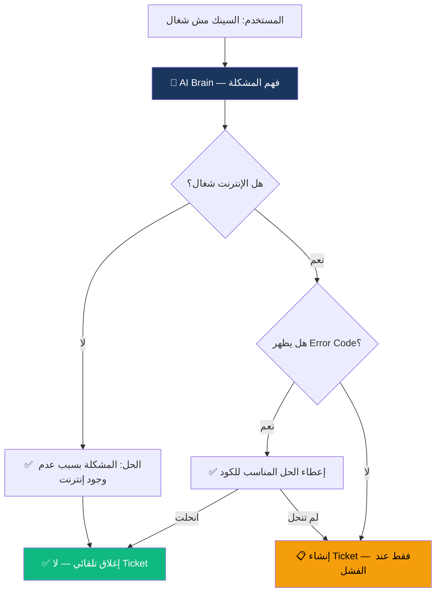
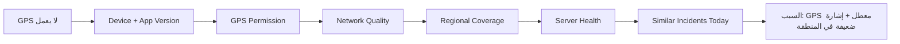
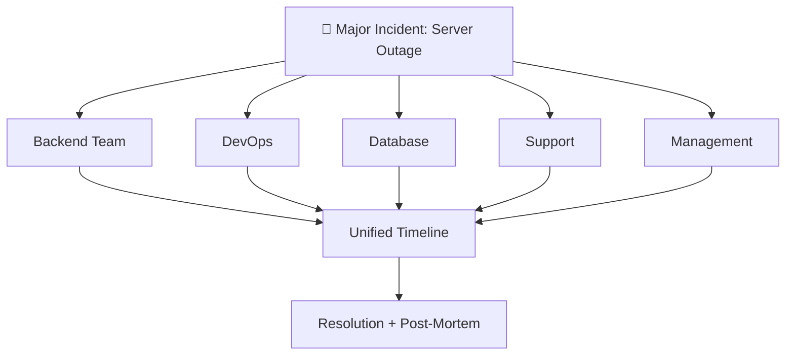
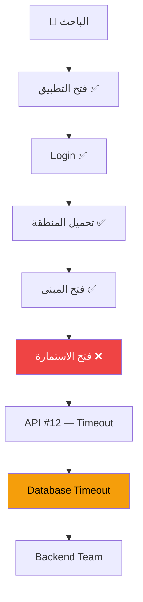
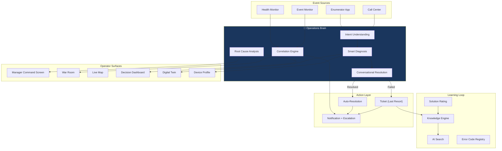

# JCOCC — Product Vision & Capability Manifest

**Document ID:** JCOCC-PV-001  
**Status:** Approved Direction (Stakeholder Vision)  
**Language:** Arabic / English  
**Version:** 1.0.0

---

## المبدأ الأول — وانت عنق الزجاجة

> **الهدف الأول للنظام ليس تسجيل المشاكل.**  
> **الهدف الأول هو تقليل عدد المشاكل التي تصل إلى Support Operations Manager.**

إذا كل مشكلة يجب أن تمر على مدير العمليات — **ينهار في اليوم الأول.**

لذلك JCOCC ليس Help Desk.  
JCOCC هو **عقل تشغيلي (Operations Brain)** يحل المشكلة **قبل** أن تصل للإنسان.

### قاعدة ذهبية

| ❌ Ticket System | ✅ Operations Brain |
|------------------|---------------------|
| يسجل المشكلة | يفهم المشكلة |
| يوجّه للإنسان | يحاول الحل أولاً |
| ينتظر الشكوى | يراقب ويتنبأ |
| Manager = Router | Manager = Commander للاستثناءات فقط |

**الهدف الكمي:** > 40% من المشاكل تُحل بدون وصول لأي إنسان.  
**الهدف لمدير العمليات:** < 10% من الأحداث تحتاج تدخله المباشر.

---

## الـ 20+ قدرة — Capability Manifest

### 1. 🧠 Operations Brain (Conversational Resolution)

**الوصف:** محادثة ذكية متعددة الخطوات — ليس رداً واحداً.

**التدفق:**
1. فهم النية (Intent) — "السينك مش شغال"
2. أسئلة تشخيصية تلقائية (Decision Tree + AI)
3. حل مقترح أو تنفيذ تلقائي
4. إغلاق تلقائي عند النجاح
5. Ticket **فقط** عند استنفاد مسار الحل

**Actors:** Enumerator, Supervisor, Call Center Agent  
**AI Role:** Intent classification, dynamic question generation, solution matching  
**KPI:** First-contact resolution rate, tickets avoided

---

### 2. 🔬 Smart Diagnosis (التشخيص الذكي)

**الوصف:** النظام **لا يرد مباشرة** — يفحص السياق الكامل أولاً.

**مصادر البيانات للفحص:**

| المصدر | البيانات |
|--------|----------|
| Device Profile | نوع الجهاز، Android، إصدار التطبيق |
| Journey State | آخر مرحلة، آخر مزامنة |
| Telemetry | GPS مفتوح؟، جودة الإنترنت |
| Geography | تغطية المنطقة، المحافظة |
| Infrastructure | حالة السيرفر، API health |
| Correlation | مشاكل عامة اليوم في نفس المنطقة/النوع |

**Output:** السبب الأقرب + Confidence Score + الإجراء الموصى به

---

### 3. 📡 Event Monitor (المراقبة والارتباط)

**الوصف:** مراقبة تلقائية — بدون أن يخبر أحد.

**مثال:**
- خلال 5 دقائق: 200 شخص اشتكوا من Login
- النظام: يربط → يصنّف → Alert → Incident → إشعار Backend

**قواعد التفعيل:**

| الشرط | الإجراء |
|-------|---------|
| > 100 حدث متشابه / 5 دق | Major Incident Alert |
| > 20 حدث / محافظة / 5 دق | Governorate Alert |
| نمط جديد (Anomaly) | AI Investigation |

**Message Example:**
> 🚨 **مشكلة عامة في تسجيل الدخول** — 200 مستخدم متأثر خلال 5 دقائق.  
> التشخيص الأولي: Backend Auth Service.  
> تم إشعار: Backend Team + DevOps.

---

### 4. 🔔 Notification Engine + Auto-Escalation

**الوصف:** ليس إشعاراً واحداً — **سلم تصعيد زمني.**

**مثال SLA = 60 دقيقة:**

| الوقت | الإجراء |
|-------|---------|
| T+0 | Incident assigned → Developer notified |
| T+40 | ⏰ Reminder #1 → Developer |
| T+50 | ⏰ Reminder #2 → Developer (urgent) |
| T+60 | ⬆️ Escalate → Team Lead |
| T+75 | ⬆️ Escalate → Management |

**Channels:** Push, SMS, Email, In-App, War Room banner

---

### 5. 🏛️ War Room (غرفة العمليات)

**الوصف:** عند انهيار سيرفر أو مشكلة وطنية — **صفحة واحدة للجميع.**

**Participants:** Backend, DevOps, DBA, Support, GIS, Management

**Contents:**
- Incident status (live)
- Timeline — من عمل ماذا، متى، لماذا
- Chat / coordination channel
- AI diagnosis panel
- Action log
- Decision record

---

### 6. 💚 Health Monitor (المراقبة الاستباقية)

**الوصف:** لا تنتظر الشكاوى — **راقب كل شيء.**

**Services Monitored:**

| Category | Services |
|----------|----------|
| Application | Backend, API Gateway, Auth, Sync, Self-Enum Portal |
| Data | Database Primary/Replica, Redis, Queue |
| Infrastructure | CPU, Memory, Disk, Network |
| Communication | SMS, Email, Push Notification |
| External | Maps, GPS Services |

**Rule:** أي service caída → Incident تلقائي → Team assignment → Notification

---

### 7. 🗺️ Live Map (الخريطة الحية)

**الوصف:** خريطة الأردن — **ترى المشكلة قبل أن يرن الهاتف.**

**Hierarchy:** محافظة → لواء → منطقة

**Color Coding:**

| اللون | المعنى |
|-------|--------|
| 🔴 أحمر | مشاكل حرجة / حوادث مفتوحة |
| 🟠 برتقالي | Sync issues |
| 🟡 أصفر | Login issues |
| 🔵 أزرق | GPS issues |
| 🟢 أخضر | سليم |

**Interaction:** Click region → drill-down → incidents → affected enumerators

---

### 8. 📚 Knowledge Engine (محرك المعرفة)

**الوصف:** كل Ticket محلول → **مقال تلقائي.**

**Article Structure:**
- العنوان
- السبب (Root Cause)
- الحل (Steps)
- الأجهزة المتأثرة
- الكلمات المفتاحية
- المشاكل المشابهة (linked)
- Success rate (from ratings)

**After 1 month:** آلاف الحلول — **المؤسسة لا تنسى.**

---

### 9. 🔍 AI Search (البحث باللغة الطبيعية)

**الوصف:** لا يكتب "GPS" — يكتب:

> "الباحث واقف قدام البيت ومش راضي يحدد الموقع"

**AI:** يفهم → يطابق → يجيب الحل + مقالات ذات صلة

---

### 10. 🎯 Root Cause Analysis (تحليل السبب الجذري)

**الوصف:** لا يكتفي بـ "تم الحل" — **يسأل: ليش صارت؟**

**Categories:**

| Category | Examples |
|----------|----------|
| Bug | Application defect |
| User Error | Training gap |
| Network | Connectivity, latency |
| Server | Outage, overload |
| Permission | GPS, storage, auth |
| Device | Hardware, storage full |
| Training | Enumerator skill gap |
| GIS | Missing spatial data |
| Database | Timeout, lock |
| Application | Crash, version mismatch |

**Output:** إحصائيات — مثلاً: **60% من المشاكل = Training** → قرار إداري: برنامج تدريب، لا patch تقني.

---

### 11. 📊 Decision Dashboard (لوحة القرار — للإدارة)

**Live KPIs:**
- كم مشكلة اليوم
- كم Critical
- كم محافظة متأثرة
- كم سيرفر Down
- كم باحث متوقف
- كم مركز اتصال متأثر

---

### 12. 🤖 AI Assistant for Center Technical Support

**الوصف:** الدعم الفني المراكز يكتب → AI يرد بمسار حل متدرج.

**Example:**
> الدعم الفني المراكز: "الباحث عنده Error 500"

> AI: **الحل الأول:** ...  
> *(إذا لم ينفع)* **الحل الثاني:** ...  
> *(إذا لم ينفع)* **أنشئ Ticket** مع السياق الكامل.

---

### 13. ⭐ Solution Rating (تقييم الحلول)

**الوصف:** بعد الحل — الدعم الفني المراكز يقيّم ★★★★★ أو ★☆☆☆☆

**Use:** 
- Knowledge Engine prioritizes high-rated solutions
- AI learns which solutions work
- Weak solutions flagged for review

---

### 14. 🔗 Similar Tickets (المشاكل المشابهة)

**الوصف:** أول ما تُكتب المشكلة:

> "وجدنا **120** مشكلة مشابهة — وهذا حلها."

**Prevents:** 120 agent investigating the same root cause separately.

---

### 15. 📄 AI Log Analysis

**الوصف:** رفع Log → AI يحلل → يخرج:

- `401 Unauthorized`
- `Database Timeout`
- `GPS Permission Missing`

**With:** recommended fix + responsible team

---

### 16. 📋 Unified Error Code Registry

**كل Error Code له صفحة:**

| Field | Example E1001 |
|-------|---------------|
| Code | E1001 |
| Title | Sync Failed — Network Timeout |
| Cause | Weak connectivity during sync |
| Solution | Enable offline mode, retry on reconnect |
| Owner Team | Backend |
| Last Occurrence | 2026-08-01 14:32 |
| Occurrence Count | 1,247 |
| Related KB Articles | 3 |

---

### 17. 👨‍💻 Team Performance Dashboard

**Per Team (Backend, DevOps, DBA, GIS, Support):**

| Metric | Description |
|--------|-------------|
| Open Tickets | Current load |
| Avg Resolution Time | Team efficiency |
| Slowest Developer | Bottleneck identification |
| Fastest Developer | Best practice source |
| Overdue Tickets | SLA breaches |
| Auto-resolved % | Automation effectiveness |

---

### 18. 🎛️ Support Manager Command Screen

**أهم شاشة — أول ما تدخل:**

| Widget | Content |
|--------|---------|
| 🔥 | Critical Incidents |
| ⏰ | SLA Breached |
| 🚨 | Top Problem Governorates |
| 📈 | Issues Last Hour |
| 🧠 | AI Recommendations |
| 📞 | Call Center Volume |
| 📱 | Top Error Codes |
| 👨‍💻 | Most Loaded Developer |
| 📍 | Blocked Enumerators |
| 🎯 | Completion Rate |

**Zero clicks** — كل شيء أمامك فور الدخول.

---

### 19. 🔄 Digital Twin (التوأم الرقمي للمشكلة)

**الوصف:** رسم **رحلة المشكلة كاملة** بصرياً.

**Value:** بدل ساعات بحث — **30 ثانية** لرؤية أين توقف ولماذا.

---

### 20. 📱 Device Profile (ملف الجهاز)

**كل باحث له صفحة:**

| Field | Value |
|-------|-------|
| Device Model | Samsung Galaxy A54 |
| Android Version | 14 |
| App Version | 3.2.1 |
| Last Sync | 2026-08-01 13:45 |
| Last GPS | 31.9539, 35.9106 |
| Network Quality | 3/5 bars, 4G |
| Last 20 Issues | [list with status] |
| Last App Update | 2026-07-28 |
| Last Login | 2026-08-01 08:00 |
| Total Reports | 7 |
| Pattern | Recurring sync issues |

**Value:** عند الاتصال — **صفر دقائق** لجمع المعلومات. كل شيء أمامك.

---

## Architecture Alignment — كيف تترابط القدرات

---

## Priority Matrix — ترتيب التنفيذ المقترح

| Phase | Capabilities | Rationale |
|-------|-------------|-----------|
| **Phase A — Brain Foundation** | #1 Brain, #2 Smart Diagnosis, #3 Event Monitor, #6 Health Monitor | يقلل الضغط فوراً |
| **Phase B — Command** | #4 Notifications, #5 War Room, #18 Manager Screen | Manager لا ينهار |
| **Phase C — Intelligence** | #8 Knowledge, #9 AI Search, #10 RCA, #14 Similar, #15 Logs | التعلم المؤسسي |
| **Phase D — Visibility** | #7 Live Map, #11 Decision Dashboard, #19 Digital Twin, #20 Device Profile | رؤية كاملة |
| **Phase E — Optimization** | #12 Supervisor AI, #13 Rating, #16 Error Registry, #17 Team Dashboard | تحسين مستمر |

---

## Success Metrics — كيف نعرف أن النظام ينجح

| Metric | Target | Meaning |
|--------|--------|---------|
| **Problems reaching Manager** | < 10% | Manager ليس Router |
| **Auto-resolution rate** | > 40% | Brain يحل بدون إنسان |
| **First-contact resolution** | > 60% | Conversational flow works |
| **Proactive detection** | > 60% | Event Monitor catches before reports |
| **Duplicate work rate** | < 5% | Similar Tickets merge works |
| **Time to diagnose** | < 30 sec | Smart Diagnosis + Digital Twin |
| **KB articles generated** | 500+ / census | Knowledge Engine learning |
| **Manager dashboard load time** | < 3 sec | Command screen instant |

---

## What This Is NOT

- ❌ Ticket System with AI bolted on
- ❌ Help Desk replacement
- ❌ CRM
- ❌ Reporting-only dashboard
- ❌ Manual escalation via phone/WhatsApp

## What This IS

- ✅ Operations Brain that thinks before escalating
- ✅ Proactive intelligence platform
- ✅ National census command center
- ✅ Institutional memory that grows
- ✅ Manager liberation system

---

> **هذا المستند هو المرجع الرسمي لتوجيه JCOCC.**  
> أي تصميم أو تنفيذ لاحق يجب أن يخدم هذه القدرات — وليس العكس.

---

*Jordan Census Operations Control Center (JCOCC)*  
*Product Vision & Capability Manifest v1.0.0*
